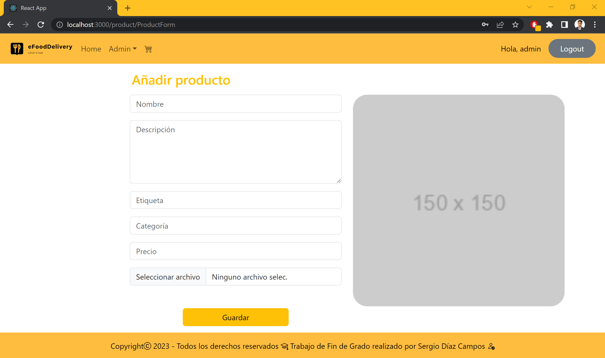

# eFoodDelivery Website - Trabajo de Fin de Grado

- [eFoodDelivery Website - Trabajo de Fin de Grado](#efooddelivery-website---trabajo-de-fin-de-grado)
- [0. Crear una aplicaión de React con Typescript](#0-crear-una-aplicaión-de-react-con-typescript)
  - [0.1. package.json](#01-packagejson)
  - [0.2. Limpiar y reorganizar la arquitectura inicial por defecto del proyecto](#02-limpiar-y-reorganizar-la-arquitectura-inicial-por-defecto-del-proyecto)
    - [Eliminar](#eliminar)
    - [Reorganizar](#reorganizar)
    - [Limpiar](#limpiar)
      - [App.tsx](#apptsx)
      - [index.tsx](#indextsx)
    - [index.html](#indexhtml)
  - [0.3. Instalar Bootstrap y Bootstrap Icons](#03-instalar-bootstrap-y-bootstrap-icons)
    - [src --\> index.tsx](#src----indextsx)
  - [0.4 Primera prueba de ejecución del proyecto](#04-primera-prueba-de-ejecución-del-proyecto)
- [1. Header y Footer](#1-header-y-footer)
  - [1.1. Header.tsx](#11-headertsx)
  - [1.2. Footer.tsx](#12-footertsx)
  - [1.3. index.tsx](#13-indextsx)
  - [1.4. App.tsx](#14-apptsx)
    - [Prueba inicial del Layout (Header y Footer)](#prueba-inicial-del-layout-header-y-footer)
  - [1.5. Obtener los productos a través de la API](#15-obtener-los-productos-a-través-de-la-api)
- [2. Página del Home](#2-página-del-home)
  - [2.1. pages --\> Home.tsx](#21-pages----hometsx)
  - [2.2. components --\> products --\> ProductList.tsx y ProductCard.tsx](#22-components----products----productlisttsx-y-productcardtsx)
  - [2.3. Prueba de ejecución con la API desplegada](#23-prueba-de-ejecución-con-la-api-desplegada)
  - [2.4. Interfaz de la página del Home](#24-interfaz-de-la-página-del-home)
    - [ProductCard.tsx](#productcardtsx)
  - [2.5. Añadiendo el routing y la página 404](#25-añadiendo-el-routing-y-la-página-404)
- [3. Página de los Detalles del Producto](#3-página-de-los-detalles-del-producto)
  - [3.1. Añadir Redux y Redux Toolkit](#31-añadir-redux-y-redux-toolkit)
  - [3.2. Añadir una consulta para buscar los productos](#32-añadir-una-consulta-para-buscar-los-productos)
  - [3.3. LLamar al Slice para buscar los productos](#33-llamar-al-slice-para-buscar-los-productos)
  - [3.4. Cargar los detalles de un producto](#34-cargar-los-detalles-de-un-producto)
  - [3.5. Controlar la cantidad de items de un producto](#35-controlar-la-cantidad-de-items-de-un-producto)
    - [Prueba de Ejecución](#prueba-de-ejecución)
- [4. Página del carrito](#4-página-del-carrito)
  - [4.1. Usuarios](#41-usuarios)
  - [4.2. Crear el endpoint del carrito](#42-crear-el-endpoint-del-carrito)
  - [4.3. Actualizar el ProductDetails y probar que se crear y se actualiza el carrito](#43-actualizar-el-productdetails-y-probar-que-se-crear-y-se-actualiza-el-carrito)
    - [Prueba de Ejecución](#prueba-de-ejecución-1)
  - [4.4. Añadir un producto al carrito desde el ProductCard](#44-añadir-un-producto-al-carrito-desde-el-productcard)
  - [4.5. Añadir un mini-loader al botón de añadir un producto al carrito en el ProductCard](#45-añadir-un-mini-loader-al-botón-de-añadir-un-producto-al-carrito-en-el-productcard)
  - [4.6. Componente del Mini-Loader](#46-componente-del-mini-loader)
  - [4.7. Componmente del BigLoader](#47-componmente-del-bigloader)
  - [4.8. Creando las interfaces del carrito y de los items del carrito](#48-creando-las-interfaces-del-carrito-y-de-los-items-del-carrito)
    - [CartIterface.ts](#cartiterfacets)
    - [CartItemInterface](#cartiteminterface)
  - [4.9. Slice para el carrito](#49-slice-para-el-carrito)
  - [4.10. Crear la vista de la página del Carrito](#410-crear-la-vista-de-la-página-del-carrito)
  - [4.11. Desarrollando el componente del CartRecap](#411-desarrollando-el-componente-del-cartrecap)
  - [4.12. Añadir más reducers a nuestro slice del carrito](#412-añadir-más-reducers-a-nuestro-slice-del-carrito)
  - [4.13. Implementando las nuevas funcionalidades en el componente del resumen del carrito](#413-implementando-las-nuevas-funcionalidades-en-el-componente-del-resumen-del-carrito)
    - [Prueba de ejecución](#prueba-de-ejecución-2)
  - [4.14. Mostrar el número de productos en el icono del carrito](#414-mostrar-el-número-de-productos-en-el-icono-del-carrito)
  - [4.15. Mostrar los detalles del pedido a la derecha en el carrito](#415-mostrar-los-detalles-del-pedido-a-la-derecha-en-el-carrito)
  - [4.16. Desarrollar los métodos de ayuda para los campos a rellenar del DeliveryDetails](#416-desarrollar-los-métodos-de-ayuda-para-los-campos-a-rellenar-del-deliverydetails)
  - [4.17. Añadiendo un mini-loader cuando el botón de encargar el pedido es pulsado](#417-añadiendo-un-mini-loader-cuando-el-botón-de-encargar-el-pedido-es-pulsado)
- [5. Autentificación y Autorización de Usuarios](#5-autentificación-y-autorización-de-usuarios)
  - [5.1. Páginas del Login y el Register](#51-páginas-del-login-y-el-register)
  - [5.2. Crear las nuevas mutations para los nuevos endpoint del login y el register](#52-crear-las-nuevas-mutations-para-los-nuevos-endpoint-del-login-y-el-register)
  - [5.3. Slice para la autentificación e Interfaz para el usuario](#53-slice-para-la-autentificación-e-interfaz-para-el-usuario)
  - [5.4. Reutilizando el método de ayuda del InputHelper en el Registro](#54-reutilizando-el-método-de-ayuda-del-inputhelper-en-el-registro)
  - [5.5. Lógica del registro de usuario](#55-lógica-del-registro-de-usuario)
  - [5.6. Lógica y funcionalidad del Login](#56-lógica-y-funcionalidad-del-login)
  - [5.7 Descodificar el token para obtener su información](#57-descodificar-el-token-para-obtener-su-información)
  - [5.8. Alternar botones de acceso en el Header y bienvenida al usuario](#58-alternar-botones-de-acceso-en-el-header-y-bienvenida-al-usuario)
  - [5.9. Funcionalidad del Logout](#59-funcionalidad-del-logout)
    - [Prueba de ejecución](#prueba-de-ejecución-3)
  - [5.10. Añadir las notificaciones *Toast*](#510-añadir-las-notificaciones-toast)
  - [5.11. Autentificación del usuario con High-Order-Component (HOC)](#511-autentificación-del-usuario-con-high-order-component-hoc)
  - [5.12. Autorización del usuario con High-Order-Component (HOC)](#512-autorización-del-usuario-con-high-order-component-hoc)
  - [5.13. Añadir la lógica de que sólo los usuarios identificados puedan añadir productos al carrito](#513-añadir-la-lógica-de-que-sólo-los-usuarios-identificados-puedan-añadir-productos-al-carrito)
  - [5.14. Cambiar el id estático del usuario "admin" por un id dinámico](#514-cambiar-el-id-estático-del-usuario-admin-por-un-id-dinámico)
    - [Prueba de ejecución](#prueba-de-ejecución-4)
- [6. Procesamiento de los pagos con Stripe](#6-procesamiento-de-los-pagos-con-stripe)
  - [6.1. Crear el endpoint para el pago](#61-crear-el-endpoint-para-el-pago)
  - [6.2. LLamar al endpoint del pago y pasar los datos a una nueva vista](#62-llamar-al-endpoint-del-pago-y-pasar-los-datos-a-una-nueva-vista)
  - [6.3. Integrar Stripe en la vista de los detalles del pago](#63-integrar-stripe-en-la-vista-de-los-detalles-del-pago)
  - [6.4. Componente del resumen del pedido y su interfaz](#64-componente-del-resumen-del-pedido-y-su-interfaz)
  - [6.5. Probando el procesamiento del pago con Stripe](#65-probando-el-procesamiento-del-pago-con-stripe)
- [7. Página del pedido](#7-página-del-pedido)
  - [7.1. Crear el endpoint del pedido](#71-crear-el-endpoint-del-pedido)
  - [7.2. Crear un objeto con la respuesta heredada para poder crear el pedido](#72-crear-un-objeto-con-la-respuesta-heredada-para-poder-crear-el-pedido)
  - [7.3. Crear el pedido](#73-crear-el-pedido)
    - [Prueba de ejecución](#prueba-de-ejecución-5)
  - [7.4. Enviar el id del pedido y redireccionar al usuario a una página de confirmación](#74-enviar-el-id-del-pedido-y-redireccionar-al-usuario-a-una-página-de-confirmación)
  - [7.5. Implementar las queries de los endpoint del GetOrder(userId) y GetOrder(orderId)](#75-implementar-las-queries-de-los-endpoint-del-getorderuserid-y-getorderorderid)
  - [7.6. Página de la lista de pedidos del usuario](#76-página-de-la-lista-de-pedidos-del-usuario)
  - [7.7. Mover la lista de pedidos a un componente diferente en sí mismo](#77-mover-la-lista-de-pedidos-a-un-componente-diferente-en-sí-mismo)
  - [7.8. Crear otro tipo de resumen del pedido para el botón de los detalles de pedido](#78-crear-otro-tipo-de-resumen-del-pedido-para-el-botón-de-los-detalles-de-pedido)
  - [7.9. Aplicar colores en botones según el estado de los pedidos](#79-aplicar-colores-en-botones-según-el-estado-de-los-pedidos)
  - [7.10. Implementar la lógica para el cambio de los estados del pedido](#710-implementar-la-lógica-para-el-cambio-de-los-estados-del-pedido)
  - [7.11. Añadiendo también el estado del pedido en la lista de pedidos](#711-añadiendo-también-el-estado-del-pedido-en-la-lista-de-pedidos)
  - [7.12. Añadir una mutación tipo PUT en el endpoint del pedido par actualizar el estado](#712-añadir-una-mutación-tipo-put-en-el-endpoint-del-pedido-par-actualizar-el-estado)
  - [7.13. Actualizar el estado del pedido con los botones](#713-actualizar-el-estado-del-pedido-con-los-botones)
  - [7.14. Crear la página de los pedidos de todos los usuarios para el administrador](#714-crear-la-página-de-los-pedidos-de-todos-los-usuarios-para-el-administrador)
    - [Prueba de ejecución](#prueba-de-ejecución-6)
- [8. Página de la gestión de los productos](#8-página-de-la-gestión-de-los-productos)
  - [8.1. Crear la página del listado de productos del admin](#81-crear-la-página-del-listado-de-productos-del-admin)
  - [8.2. Crear la página del formulario para la cración y edición de los productos](#82-crear-la-página-del-formulario-para-la-cración-y-edición-de-los-productos)
  - [8.3. Gestión y validación de la subida de imágenes en el formulario de producto](#83-gestión-y-validación-de-la-subida-de-imágenes-en-el-formulario-de-producto)
  - [8.4. Añadir las mutaciones para el POST, PUT y DELETE en el endpoint de producto](#84-añadir-las-mutaciones-para-el-post-put-y-delete-en-el-endpoint-de-producto)
  - [8.5. Implementar la funcionalidad de crear un producto](#85-implementar-la-funcionalidad-de-crear-un-producto)
  - [8.6. Implementar la funcionalidad de editar un producto](#86-implementar-la-funcionalidad-de-editar-un-producto)
    - [Prueba de ejecución](#prueba-de-ejecución-7)
  - [8.7. Implementar un botón dropdown para seleccionar una categoría ya existente](#87-implementar-un-botón-dropdown-para-seleccionar-una-categoría-ya-existente)
  - [8.8. Implementar la funcionalidad de eliminar un producto (sin confirmación activa, desde el mismo AdminProductList)](#88-implementar-la-funcionalidad-de-eliminar-un-producto-sin-confirmación-activa-desde-el-mismo-adminproductlist)
  - [8.9. Implementar la funcionalidad de eliminar un producto (con confirmación activa, desde una nueva página)](#89-implementar-la-funcionalidad-de-eliminar-un-producto-con-confirmación-activa-desde-una-nueva-página)
    - [Prueba de ejecución](#prueba-de-ejecución-8)
- [Webgrafía y Enlaces de Interés](#webgrafía-y-enlaces-de-interés)
    - [1. What is the meaning of the "at" (@) prefix on npm packages?](#1-what-is-the-meaning-of-the-at--prefix-on-npm-packages)
    - [2. Bootstrap components](#2-bootstrap-components)
    - [3. Enlace a Bootstrap-Icons](#3-enlace-a-bootstrap-icons)
    - [4. Usando el Hook de useState()](#4-usando-el-hook-de-usestate)
    - [5. Usando el Hook de useEffect()](#5-usando-el-hook-de-useeffect)
    - [6. Components and Props](#6-components-and-props)
    - [7. Conditional Rendering](#7-conditional-rendering)
    - [8. BrowserRouter - Routes - NavLink - Link](#8-browserrouter---routes---navlink---link)
    - [9. Redux Toolkit Guide - Creating Slices](#9-redux-toolkit-guide---creating-slices)
    - [10. Redux Toolkit - createApi](#10-redux-toolkit---createapi)
    - [11. Redux Toolkit - fetchBaseQuery](#11-redux-toolkit---fetchbasequery)
    - [12. Redux Toolkit - getDefaultMiddleware](#12-redux-toolkit---getdefaultmiddleware)
    - [13. What is useDispatch() hook](#13-what-is-usedispatch-hook)
    - [14. How to use useParams() hook](#14-how-to-use-useparams-hook)
    - [15. How to use useNavigation() hook](#15-how-to-use-usenavigation-hook)
    - [16. Items counter example with useState() hook](#16-items-counter-example-with-usestate-hook)
    - [17. Redux Toolkit - Mutations](#17-redux-toolkit---mutations)
    - [18. React Loader Spinners](#18-react-loader-spinners)
    - [19. What is useSelector() hook](#19-what-is-useselector-hook)
    - [20. Handle Forms - React.ChangeEvent](#20-handle-forms---reactchangeevent)
    - [21. jwt-decode npm package with example](#21-jwt-decode-npm-package-with-example)
    - [22. Distructuring technique with ellipsis](#22-distructuring-technique-with-ellipsis)
    - [23. react-toastify npm package](#23-react-toastify-npm-package)
    - [24. High Order Component - Authentication and Autorization](#24-high-order-component---authentication-and-autorization)
    - [25. React Stripe.js reference](#25-react-stripejs-reference)
    - [26. Passing parameter through pages with useNavigation() and receiving them with useLocation()](#26-passing-parameter-through-pages-with-usenavigation-and-receiving-them-with-uselocation)
    - [27. Stripe --\> tarjetas de prueba por marcas](#27-stripe----tarjetas-de-prueba-por-marcas)
    - [28. Stripe Payment Intents --\> stripe.confirmPayment(options)](#28-stripe-payment-intents----stripeconfirmpaymentoptions)
    - [29. Handling promises with react toast notifications](#29-handling-promises-with-react-toast-notifications)
- [Pruebas de Ejecución](#pruebas-de-ejecución)
  - [Lista de productos y Detalles del producto](#lista-de-productos-y-detalles-del-producto)
    - [Prueba de ejecución de ir del menu de la lista de productos al detalle de un producto y viceversa](#prueba-de-ejecución-de-ir-del-menu-de-la-lista-de-productos-al-detalle-de-un-producto-y-viceversa)
  - [Carrito](#carrito)
    - [Prueba de ejecución de creación y actualización del carrito a través del botón de añadir un producto](#prueba-de-ejecución-de-creación-y-actualización-del-carrito-a-través-del-botón-de-añadir-un-producto)
    - [Prueba de ejecución para probar las funcionalidades del carrito - Actualizar las cantidades de los productos y eliminar los productos](#prueba-de-ejecución-para-probar-las-funcionalidades-del-carrito---actualizar-las-cantidades-de-los-productos-y-eliminar-los-productos)
  - [Autentificación y Autorización](#autentificación-y-autorización)
    - [Prueba de ejecución para probar la funcionalidad del Login y Logout](#prueba-de-ejecución-para-probar-la-funcionalidad-del-login-y-logout)
    - [Prueba de ejecución para probar el userId dinámico, el HOC, y las notificaciones toast](#prueba-de-ejecución-para-probar-el-userid-dinámico-el-hoc-y-las-notificaciones-toast)
  - [Pedido](#pedido)
    - [Prueba de ejecución para probar la creación de un objeto de pedido](#prueba-de-ejecución-para-probar-la-creación-de-un-objeto-de-pedido)
    - [Prueba de ejecución de toda la parte relativa a los pedidos, desde la creación de un pedido hasta su entrega](#prueba-de-ejecución-de-toda-la-parte-relativa-a-los-pedidos-desde-la-creación-de-un-pedido-hasta-su-entrega)
  - [CRUD de Producto](#crud-de-producto)
    - [Prueba de ejecución para probar la funcionalidad de editar un producto](#prueba-de-ejecución-para-probar-la-funcionalidad-de-editar-un-producto)
    - [Prueba de ejecución para probar todas las funcionalidades del CRUD de producto](#prueba-de-ejecución-para-probar-todas-las-funcionalidades-del-crud-de-producto)
- [Extras](#extras)
  - [Crear una interfaz para las respuesta de la API](#crear-una-interfaz-para-las-respuesta-de-la-api)
  - [Evitar perder el contenido del almacenamiento de Redux con los valores del token del usuario](#evitar-perder-el-contenido-del-almacenamiento-de-redux-con-los-valores-del-token-del-usuario)
  - [Enlace al espacio de trabajo y al tablero del proyecto en Trello](#enlace-al-espacio-de-trabajo-y-al-tablero-del-proyecto-en-trello)
    - [Enlace a Trello - Espacio de trabajo y Tablero del proyecto eFoodDelivery-Website](#enlace-a-trello---espacio-de-trabajo-y-tablero-del-proyecto-efooddelivery-website)


# 0. Crear una aplicaión de React con Typescript

La segunda parte de este proyecto (la parte web del cliente), voy a desarrollarla en React usando como lenguaje base Typescript.

Para ello, si vamos a la web de [Create React App](https://create-react-app.dev/docs/getting-started#selecting-a-template) y bajamos un poco en ella, podremos encontrar un comando para crear una aplicación de React con una plantilla de base con Typescript.

Cabe mencionar que, la diferencia que hay entre Javascript y Typescript es que: 

- TypeScript dispone de una escritura estática, mientras que JavaScript es un lenguaje dinámico. 
- JavaScript no admite módulos, mientras que TypeScript sí que les da soporte. 
- TypeScript dispone de interfaz, mientras que JavaScript no. 
- En TypeScript sí que hay que compilar el código, en JavaScript no es necesario.

Al fin y al cabo, la razón principal por la que he decidido usar Typescript para la parte principal del proyecto, es porque cuando el proyecto vaya creciendo, si ya de base vamos atando nuestras variables a ciertos tipos, será menos propenso a encontrarse errores al ejecutar la aplicación. 

También en aplicaciones de gran escala, entre la comunidad de desarrolladores y clientes, típicamente se prefiere Typescript, ya que así se fuerza a seguir ciertas reglas y regulaciones.

Está claro que construir aplicaciones con soporte en Typescript conlleva mayor tiempo de desarrollo, pero el código será más limpio, y por lo tanto, el producto final será mucho mejor.


## 0.1. package.json

Antes de nada, debemos tener en cuenta que durante el desarrollo de la parte web cliente, iremos necesitando añadir a nuestra aplicación diferentes paquetes de funciones externas.

A medida que vayamos instalando paquetes con *npm install ...*, éstos se irán añadiendo al *package.json* con el número de la versión que instalemos. Esto a su vez quiere decir que, con el tiempo, estas versiones podrán irse actualizando y cambiando, y por lo cual, podríamos caer en ciertos errores por ello.

Para intentar solventar esas posibles situaciones anómalas de antemano, se recomienda muchísimo predefinir con anterioridad al desarrollo, los diferentes paquetes que vayamos a necesitar con las versiones que queramos mantener de ellos. Y esto lo haremos en el archivo de configuración que tenemos en el *root folder* llamado *package.json*, y a su vez, dentro de él, en la sección de *dependencies*.

```json
...
"dependencies": {
    // default dependencies added when app is created
    "@testing-library/jest-dom": "^5.16.5",
    "@testing-library/react": "^13.4.0",
    "@testing-library/user-event": "^13.5.0",
    "@types/jest": "^27.5.2",
    "@types/node": "^16.18.23",
    "@types/react": "^18.0.33",
    "@types/react-dom": "^18.0.11",
    // regular packages
    "react": "^18.2.0",
    "react-dom": "^18.2.0",
    "react-scripts": "5.0.1",
    "typescript": "^4.9.5",
    "web-vitals": "^2.1.4",
    "bootstrap": "^5.2.3",
    "bootstrap-icons": "^1.10.2",
    "jwt-decode": "^3.1.2",
    "react-redux": "^8.0.5",
    "react-router-dom": "^6.5.0",
    "react-toastify": "^9.1.1",
    // scoped packages
    "@reduxjs/toolkit": "^1.9.1",
    "@stripe/react-stripe-js": "^1.16.1",
    "@stripe/stripe-js": "^1.46.0"
},
...
```

Tras definir todos los paquetes que utilizaremos durante el desarrollo de esta app y sus versiones, podemos instalarlos todos de una sóla vez, ejecutando el comando:

```bash
npm install
```


**Nota:** aunque a medida que avance en el desarrollo de la app, iré especificando cómo se instalarían cada uno de los paquetes por separado e independientemente, con sus respectivos comandos de *npm install ...*, así como los usos y diferentes funciones que desempeñarán en el desarrollo.

## 0.2. Limpiar y reorganizar la arquitectura inicial por defecto del proyecto

### Eliminar

Antes de empezar con el desarrollo de esta parte del proyecto, vamos a eliminar los siguientes archivos que se han creado por defecto:

• carpeta *public*:
- logo192.png
- logo512.png
- manifest.json
- robots.txt

• carpeta *src*:
- App.css
- App.test.tsx
- logo.svg
- react-app-env.tsx
- reportWebVital.ts
- setupTest.ts

### Reorganizar

• carpeta *src*:
- creamos una nueva carpeta llamada *app*, y en ella metemos el archivo del App.tsx, el cual es básicamente el principal contenedor de nuestra aplicación
- el archivo index.tsx contiene a su vez el App.tsx y es el esqueleto original de toda la aplicación de React
- para sustituir las imágenes de los logos que hemos eliminado antes, vamos a crear una nueva carpeta llamada *assets*, y a su vez, dentro de ella crearemos otra nueva carpeta para las imágenes llamada *images* (no le ponemos img porque podría confundirse con la misma del root folder del proyecto para las imágenes del readme.md), y en esta nueva carpeta metemos la imagen del logo de nuestra aplicación

### Limpiar

Por último, vamos a limpiar un poco el código de los archivo del *App.tsx* y el *index.tsx* de la carpeta *src*, y el *index.html* de la carpeta *public*

#### App.tsx

```tsx
import React from 'react';

function App() {
  return (
    <div className="App">
      eFoodDelivery
    </div>
  );
}

export default App;
```

#### index.tsx

```tsx
import React from 'react';
import ReactDOM from 'react-dom/client';
import './index.css';
import App from './app/App';


const root = ReactDOM.createRoot(
  document.getElementById('root') as HTMLElement
);

root.render(
  <App />
);
```

### index.html

```html
<!DOCTYPE html>
<html lang="en">
  
  <head>
    <meta charset="utf-8" />
    <link rel="icon" href="%PUBLIC_URL%/favicon.ico" />
    <meta name="viewport" content="width=device-width, initial-scale=1" />
    <meta name="theme-color" content="#000000" />
    <meta name="description" content="Web site created using create-react-app" />
    <title>React App</title>
  </head>

  <body>
    <noscript>You need to enable JavaScript to run this app.</noscript>
    <div id="root"></div>
  </body>

</html>
```

Y en estos momentos, la arquitectura del proyecto con la que partiremos de base debería de verse tal que así:


## 0.3. Instalar Bootstrap y Bootstrap Icons

Como framework de CSS básico e inicial utilizaré Bootstrap.

Para implementar Bootstrap en nuestra aplicación, si bien es cierto que a través de su misma web oficial, podemos coger el CDN del CSS y del JS, y pegarlo en nuestro *index.html* de la carpeta *public*, como estoy trabajando en React, lo suyo es instalarlo, y para ello voy a ejecutar el comando de *npm* que podemos encontrar en el mismo home de la web de Bootstrap:

```bash
npm i bootstrap@5.3.0-alpha3
```

Si navegamos a su sección de *Icons*, igualmente encontraremos el comando para instalar los iconos de Bootstrap:

```bash
npm i bootstrap-icons
```

### src --> index.tsx

Vamos a añadir las importaciones de Bootstrap aquí para que funcione en todo la aplicación

```tsx
...
import "bootstrap/dist/css/bootstrap.css";
import "bootstrap/dist/js/bootstrap.js";
import "bootstrap-icons/font/bootstrap-icons.css";
...
```

## 0.4 Primera prueba de ejecución del proyecto

Para lanzar nuestro proyecto y ver en local cómo llevamos el desarrollo del mismo, tan sólo necesitamos ejecutar el siguiente comando:

```bash
npm start
```


# 1. Header y Footer

En la carpeta de *src* vamos a crear a su vez dos subcarpetas más, una llamada *components* y otra llamada *pages* (las páginas estrán compuestas de componentes).

Para el caso de este apartado, el Header y el Footer serán componentes, ya que no constituyen ninguna página en sí mismos.

Pero sí serán estructuras fijas y estáticas que y estarán presentes en todas las páginas, lo cual es un elemento que popularmente se conoce como "layout".

Así que dentro de la carpeta de *components* creamos otra carpeta más llamada *layout*.

Y ahora sí, dentro de esta carpeta creamos los componentes del Header.tsx y el Footer.tsx.

**Nota:** cada vez que creamos un nuevo componente, con la extensión de VScode de "ES7+ React/Redux/React-Native snippets" podemos snipear el esqueleto inicial básico de partida escribiendo simplemente *rfce* (react functional export component) y pulsando *intro*

## 1.1. Header.tsx

```tsx
import React from 'react'

let appLogo = require("../../assets/images/eFoodDeliveryLogo.png");

function Header() {
  return (
    <div>
      <nav style={{background:'#ffbd40'}} className="navbar navbar-expand-lg text-black">
        <div className="container-fluid">
          
          <button className="navbar-toggler" type="button" data-bs-toggle="collapse" data-bs-target="#navbarSupportedContent" aria-controls="navbarSupportedContent" aria-expanded="false" aria-label="Toggle navigation">
            <span className="navbar-toggler-icon"></span>
          </button>
          <div className="collapse navbar-collapse" id="navbarSupportedContent">
            <ul className="navbar-nav me-auto mb-2 mb-lg-0">
              <li className="nav-item">
                <a className="nav-link" aria-current="page" href="#">Home</a>
              </li>

              <li className="nav-item dropdown">
                <a className="nav-link dropdown-toggle" href="#" role="button" data-bs-toggle="dropdown" aria-expanded="false">
                  Admin
                </a>
                <ul className="dropdown-menu">
                  <li><a className="dropdown-item" href="#">Action</a></li>
                  <li><a className="dropdown-item" href="#">Another action</a></li>
                  <li><a className="dropdown-item" href="#">Something else here</a></li>
                </ul>
              </li>
            </ul>
          </div>
        </div>
      </nav>
    </div>
  )
}

export default Header
```

**Nota:** para la cabecera he copiado y pegado el primer componente de ejemplo de Bootstrap y lo he retocado básicamente.

## 1.2. Footer.tsx

```tsx
import React from 'react'

function Footer() {
  return (
    <div style={{background:'#ffbd40'}} className='footer fixed-bottom text-center p-3 text-black'>
      Copyright<i className="bi bi-c-circle"></i>2023&nbsp;-&nbsp;
      <i className="bi bi-mortarboard"></i>&nbsp;Trabajo de Fin de Grado realizado por Sergio Díaz Campos&nbsp;
      <i className="bi bi-person-check"></i>
    </div>
  )
}

export default Footer
```

## 1.3. index.tsx

Es una buena práctica y muy recomendable que, dentro de cada carpeta de componentes creemos un *index.tsx* para importar todos los componentes de esa misma carpeta para después importarlos todos en una sóla línea.

```tsx
import Header from "./Header";
import Footer from "./Footer";

export {Header, Footer}
```

## 1.4. App.tsx

Ahora ya tan sólo tenemos que llamar al Header y al Footer en el *App.tsx*

```tsx
function App() {
  return (
    <div>
      <Header />
        eFoodDelivery
      <Footer />
    </div>
  );
}
```

### Prueba inicial del Layout (Header y Footer)


## 1.5. Obtener los productos a través de la API

Ahora ha llegado el momento de empezar a consumir la API que ya había desarrollado en la primera parte de este TFG.

Comenzaremos haciendo una prueba para obtener los productos de la BBDD en el mismo *App.tsx* (aunque después lo moveremos a un componente propio).

Vamos a utilizar un par de hooks de React. Para traer los productos de la BBDD usaremos el *UseEffect* y para almacenarlos localmente usaremos el *UseState*.

**Nota:** toda la lógica del componente va dentro de la función, pero antes del return. En el return solo va el frontend, y antes de él, va el backend.

```tsx
...
function App() {
  // I will create a local state here with the name of my products and the function that will set it will be setProducts
  // and it will be equal to an empty array
  const [products, setProducts] = useState<ProductInterface[]>([]); // we can define the type here for ProductInterface

  // after that we will use the useEffect hook and we will load that
  // we will have the arrow function here and right now we can use the default fetch function and there we have to pass the URL
  useEffect(() => {
    fetch("https://localhost:7240/api/Product") // we can get this URL from the API response when we execute the GET produt's endpoint
      // we have a promise here so we use then(), and when the fetch completes, we will be getting a response here,
      .then((response) => response.json()) // so we add the arrow function and we want to convert that to JSON
        // after that. we can add another then block here and we can get the data that is being retrieved
        .then((data) => { // and write a console.log to test if we're getting the products correctly
          console.log(data);
          setProducts(data.result); // setting the data with the useState
        })
  }, []); // when this useEffect needs to be executed, we will keep that empty. That way it will be executed evedry time the component renders

  return (
    <div>
      <Header />
        eFoodDelivery
      <Footer />
    </div>
  );
}
...
```

**Nota:** este no es el verdadero uso del useState(), pero me valía para esta prueba rápida. El useState() se usa para definir y almacenar los posibles estados en los que puede encontrarse un objeto, y proceder así con unas funciones u otras.

**Nota:** como tuve algunos problemas con Azure y eliminé la cuenta con la que desarrollé la API, hasta que no vuelva a re-desplegarla, comenzaré usando la API en local ejecutándola desde su proyecto en el VS2022.


Como podemos apreciar hasta ahora, estamos guardando los productos con el useState localmente en un array vacío. Pero recordando las buenas prácticas que aprendí en la asignatura de Angular, las entidades (como el producto en este caso) deben partir de una interfaz de origen donde se define el objeto que se recibe y se quiere sacar por pantalla.

Para definir rápido la interfaz y no equivocarnos añadiendo más/menos campos, vamos a hacer el siguiente truco.

Pegamos la URL del endpoint del GET de productos en el Chrome, y veremos el JSON de respuesta, y copiamos sólo el primer producto.

Ahora vamos a alguna web tipo que convierta un JSON en Typescript. Por ejemplo, [transform.tools](https://transform.tools/json-to-typescript), y pegamos el objeto en JSON y lo transformamos a su interfaz correspondiente en Typescript.


Y ahora ya tan sólo tenemos que crear una nueva carpeta dentro de *src*, a la que llamaremos *interfaces*, y crearemos la interfaz del producto (ProductInterface.ts) con lo que nos ha transforma la web de antes.

```ts
export default interface ProductInterface {
    md_uuid: string
    md_date: string
    id: number
    name: string
    description: string
    tag: string
    category: string
    price: number
    image: string
}
```

**Nota:** recuerda seguir la buena práctica de crear un index en cada carpeta para exportarlo todo junto.

# 2. Página del Home

## 2.1. pages --> Home.tsx

Como no sería una buena práctica que empecemos a meterlo todo en el App.tsx, para lo que hemos hecho antes de obtener los productos a través de la API, lo suyo es que creemos ahora una nueva página para ello... el Home page.

Para ello, por un lado, crearemos dentro de la carpeta *page* un nuevo archivo llamado Home.tsx. 
Y por otro lado, dentro de la carpeta de *components*, vamos a crear otra llamada *view*, y a su vez dentro de ella, otra llamada *products*, y finalmente aquí creamos el archivo del ProductList.tsx.

Lo primero que haremos será cortar/pegar la lógica que hicimos en el App.tsx en el nuevo ProductList.tsx.

```tsx
import React, { useEffect, useState } from 'react'
import { ProductInterface } from '../../../interfaces';


function ProductsList() {
  // I will create a local state here with the name of my products and the function that will set it will be setProducts
  // and it will be equal to an empty array
  const [products, setProducts] = useState<ProductInterface[]>([]); // we can define the type here for ProductInterface

  // after that we will use the useEffect hook and we will load that
  // we will have the arrow function here and right now we can use the default fetch function and there we have to pass the URL
  useEffect(() => {
    fetch("https://localhost:7240/api/Product") // we can get this URL from the API response when we execute the GET produt's endpoint
      // we have a promise here so we use then(), and when the fetch completes, we will be getting a response here,
      .then((response) => response.json()) // so we add the arrow function and we want to convert that to JSON
        // after that. we can add another then block here and we can get the data that is being retrieved
        .then((data) => { // and write a console.log to test if we're getting the products correctly
          console.log(data);
          setProducts(data.result); // setting the data with the useState
        })
  }, []); // when this useEffect needs to be executed, we will keep that empty. That way it will be executed evedry time the component renders

  
  return (
    <div>ProductsList</div>
  )
}


export default ProductsList
```

Después ponemos el componente del ProductList.tsx dentro de la nueva página del Home.tsx

```tsx
import React from 'react'
import { ProductsList } from '../components/view/products'


function Home() {
  return (
    <div>
      <div className='container p-2'>
        <ProductsList />
      </div>
    </div>
  )
}


export default Home
```

Y por último ponemos el Home.tsx entre el Header y el Footer del App.tsx

```tsx
function App() {
  return (
    <div>
      <Header />
        <Home />
      <Footer />
    </div>
  );
}
```

De modo que la nueva estructura del proyecto debería de quedar tal que así:


Y de nuevo comprobamos que la aplicación sigue funcionando perfectamente como antes:


## 2.2. components --> products --> ProductList.tsx y ProductCard.tsx

```tsx
import React from 'react'
import { ProductInterface } from '../../../interfaces'


// right now we're only passing product, but we might also be passing more things along the road
// like we're using typescript it's better to define a type for this prop here
function ProductCard(props: Props) { // right here we have to write the product will be getting props
  return (
    <div>
        {props.product.name}
    </div>
  )
}


export default ProductCard


// so I'll define a local interface here called Props
interface Props {
    product: ProductInterface;
}
```

```tsx
function ProductsList() {
  ...
  return (
    <div className='container row'>
      {/* we want to work if the products length is greater that 0, and in that case, we want the conditional rendering and iterate through the products */}
      {products.length > 0 && products.map((product, index) => (
        // we have the product card here and we'll say product is equal to this product, we'll give a unique ID with index
        <ProductCard product={product} key={index} />
      ))}
    </div>
  )
}
```

Al iterar la lista de los productos del useState() con cada carta de producto, obtendremos el siguiente resultado:


## 2.3. Prueba de ejecución con la API desplegada

He vuelto a crear una nueva cuenta gratuita de Azure y he vuelto a crear los cinco servicios que tenía.

Entonces he conseguido re-desplegar la API, por lo que voy a hacer una prueba de ejecución, pero esta vez consumiendo directamente la API desplegada en internet. 

Para ello, tan sólo tengo que ir al ProductList.tsx y poner la URL de la API desplegada en la función del useEffect() en su método de fetch("https://efooddelivery-api.azurewebsites.net/api/Product").

Y funciona perfectamente!! 🤩

## 2.4. Interfaz de la página del Home

### ProductCard.tsx

```tsx
function ProductCard(props: Props) { // right here we have to write the product will be getting props
  return (
    <div className='col-md-4 col-12 p-4'>
      {/* *********************************************** PRODUCT CARD STARTS ************************************************ */}
      <div className='card' style={{ boxShadow: '0 1px 7px 0 rgb(0 0 0 / 50%)' }}>
        <div className='card-body pt-2'>
         
          <div className='row col-10 offset-1 p-4'>
            
          </div>

          {/* in teh case we've got more than one tag, we need to define a consitional rendering */}
          {props.product.tag && props.product.tag.length > 0 && (
            <i className='bi bi-star btn btn-warning'
              style={{
                position: 'absolute',
                top: '15px',
                left: '15px',
                padding: '5px 10px',
                borderRadius: '3px',
                outline: 'none !important',
                cursor: 'pointer',
              }}
            >
              &nbsp; {props.product.tag}
            </i>
          )}

          <i className='bi bi-cart-plus btn btn-outline-danger'
            style={{
              position: 'absolute',
              top: '15px',
              right: '15px',
              padding: '5px 10px',
              borderRadius: '3px',
              outline: 'none !important',
              cursor: 'pointer',
            }}
          ></i>

          <div className='text-center'>
            <p className='card-title m-0 text-warning fs-3'>
              {props.product.name}
            </p>
            <p className='badge bg-secondary' style={{ fontSize: '12px' }}>
              {props.product.category}
            </p>
          </div>
          <p className='card-text' style={{ textAlign: 'center' }}>
            {props.product.description}
          </p>
          <div className='row text-center'>
            <h4>{props.product.price}€</h4>
          </div>
        </div>
      </div>
      {/* *********************************************** PRODUCT CARD STARTS ************************************************ */}
    </div>
  )
}
```


## 2.5. Añadiendo el routing y la página 404

En este momento, si no lo hubiéramos hecho al principio con el *package.json*, sería el momento de instalar el React Router DOM.

```bash
npm install react-router-dom
```

Para habilitar el routing, tenemos que ir en primer lugar al index.tsx principal, y envolver el contenedor principal de <App/> dentro del tag de <BrowserRouter>

```tsx
...
root.render(
  <BrowserRouter>
    <App />
  </BrowserRouter>
);
```

Luego, en el App.tsx, es donde definiremos las diferentes rutas que vaya a tener nuestra aplicación y que vayamos necesitando a medida que avancemos

```tsx
function App() {
  return (
    <div>
      <Header />
        
        <div className="pb-5">
          <Routes>
            <Route path='/' element={<Home />}></Route>
          </Routes>
        </div>
        
      <Footer />
    </div>
  );
}
```

Por último y para su aplicación final, vamos por ejemplo al componente del Header.tsx para definir bien los enlaces, y sustituímos los antiguos anclas por el tag del <NavLink> y reemplazamos el href="#" por to="/"

```tsx
...
<li className="nav-item">
  <NavLink className="nav-link" aria-current="page" to="/">
    Home
  </NavLink>
</li>
...
```

Ahora para añadir la página del NotFound.tsx, lo creamos rápidamente y tal cual viene lo usaremos. 

Vamos al App.tsx para añadir su nueva ruta (para indicar cualquier página que no se encuntre se pone con un asterisco *).

Luego en el Header.tsx añadimos un nuevo item a la lista del navbar para linkearlo con la nueva ruta y le ponemos un icono de bootstrap de un carrito de la compra...

... y comprobamos que funciona correctamente!!


# 3. Página de los Detalles del Producto

Lo primero será crear esta nueva página, y acto seguido definiremos su ruta en el App.tsx

```tsx
<Routes>
  <Route path='/' element={<Home />}></Route>
  <Route path='*' element={<NotFound />}></Route>
  <Route path='/ProductDetails/:productId' element={<ProductDetails />}></Route>
</Routes>
```

Como podemos ver, para estaruta particular, al igual que ya hacíamos en la API, necvesitaremos pasar un ID del producto en cuestión.

También vamos a linkear con este nueva ruta, la foto de cada producto en el componente del ProductCard.

```tsx
<div className='row col-10 offset-1 p-4'>
  <Link to={`/ProductDetails/${props.product.id}`}> {/* note that the route here is dynamic for the product ID */}
    
  </Link>
</div>
```

Y también le añadimos este mismo Link al nombre del producto. 

Ahora vamos a implementar alguna plantilla de bootstrap para esta nueva página de los detalles del producto.

```tsx
function ProductDetails() {
  return (
    <div className="container pt-4 pt-md-5">
      <div className="row">
        <div className="col-7">
          <h2 className="text-warning">NAME</h2>
          
          <span>
            <span className="badge text-bg-dark pt-2" style={{ height: "40px", fontSize: "20px" }}>
              CATEGORY
            </span>
          </span>

          <span>
            <span className="badge text-bg-light pt-2" style={{ height: "40px", fontSize: "20px" }}>
              SPECIAL TAG
            </span>
          </span>
          
          <p style={{ fontSize: "20px" }} className="pt-2">
            DESCRIPTION
          </p>
          
          <span className="h3">$10</span> &nbsp;&nbsp;&nbsp;
          
          <span className="pb-2  p-3" style={{ border: "1px solid #333", borderRadius: "30px" }}>
            <i className="bi bi-dash p-1" style={{ fontSize: "25px", cursor: "pointer" }}></i>
            <span className="h3 mt-3 px-3">XX</span>
            <i className="bi bi-plus p-1" style={{ fontSize: "25px", cursor: "pointer" }}></i>
          </span>
          
          <div className="row pt-4">
            <div className="col-5">
              <button className="btn btn-warning form-control">
                Add to Cart
              </button>
            </div>

            <div className="col-5 ">
              <button className="btn btn-secondary form-control">
                Back to Home
              </button>
            </div>
          </div>
        </div>
        
        <div className="col-5">
          
        </div>
      </div>
    </div>
  )
}
```


Y ahora nos paramos a plantear el cómo vamos a hacer esto, es decir, en el ProductList habíamos recuperado todos los productos de la BBDD con el hook del useEffect(), pero ahora nos enfrentemos a una nueva situación...

Necesitamos de algún modo poder coger uno de esos productos que tenemos en el ProductList y enviarlo hacia la nueva página del ProductDetails. Pues para hacer esto hay un truco... ¡vamos a utilizar la herramienta de Redux!

Con Redux, podremos tener como un "almacenamiento centralizado" y desde ahí, acceder fácilmente a cualquier objeto que queramos.

## 3.1. Añadir Redux y Redux Toolkit

Para instalar el paquete de Redux necesitamos ejecutar el siguiente comando:

```bash
npm install @reduxjs/toolkit react-redux
```

Ahora vamos a crear dentro de *src* una nueva carpeta llamada *store* por ejemplo, y dentro de ella a su vez, creamos otra para Redux.

Dentro de la carpeta de Redux, vamos a crear dos archivos, un *ReduxStorage.ts* y un *ProductSlice.ts*, los cuales serán los archivos básicos que necesitaremos para la configuración de Redux y su uso por el momento.

Lo primero de ambos, será configurar el ProductSlice

```ts
// First thing that we want to work in the slice here and we will be creating a slice, and we have to import it from Redux Toolkit
import { createSlice } from "@reduxjs/toolkit";


// and inside here we have to think about what will be the slice that we want to manage?
// we want to manage an array or list of products
// so for the initial state, we will set that as product, which is an array
const initialState = {
  product: []
};


// now we have to export the const productSlice and we say it's equal to the createSlice() method
// and here we will configure our reducer or slice
export const productSlice = createSlice({
  name: "Product",
  initialState: initialState,
  reducers: { // here we want the reducers that will be responsible for managing the state
    setProduct: (state, action) => {  // it receives two parameters, first one is the state itself, and the second one is the action
      state.product = action.payload; // we need to set the state for product which will be passed to us from the payload when we invoke this
    }
  }
});


// finally we will export the setProduct action, and we will also export the productReducer from productSlice
export const { setProduct } = productSlice.actions;
export const productReducer = productSlice.reducer;
```

En segundo lugar, ahora tenemos que configurar el ReduxStorage

```ts
// now this store is where we will manage all the slices. To configure the store we need to import the configureStore from Redux Toolkit
import { configureStore } from "@reduxjs/toolkit/dist/configureStore";
import { productReducer } from "./ProductSlice";


const reduxStorage = configureStore({ // we have to configure the objects here
  reducer: {
    productStore: productReducer  // name for the store and the reducer imported
  }
});


// now when we are working with Typescript, we basically have to export the root state and that will be the type os store state
// that way, whatever is the type of the current state of the slice that will be exported in the root state
export type RootState = ReturnType<typeof reduxStorage.getState>;
// getting the state by this way, whenever we are calling the paryicular store, Typescript will expect a type,
// and we can use that as root state that we have exported right here

export default reduxStorage;
```

Y ahora ya tan sólo tendríamos que añadir Redux a nuestra aplicación, por lo cual, iremos al nivel root, el cual es el *index.tsx* y añadiremos ahí el proveedor. Importaremos el Provider de Redux y tenemos que envolver lo que teníamos del BrowserRouter y el App, ahora dentro del tag Provider, indicando cual es el store que vamos a usar.

```tsx
root.render(
  <Provider store={reduxStorage}>
    <BrowserRouter>
      <App />
    </BrowserRouter>
  </Provider>
);
```

Si entonces ahora ejecutamos la aplicación, lo primero es comprobar que no tenemos errores en panatalla o en la consola del inspeccionar... y efectivamente no los tenemos, todo sigue funcionando perfectamente!!

## 3.2. Añadir una consulta para buscar los productos

Ahora que vamos a utilizar Redux, la cosa es que en vez de sobrecargar nuestra aplicación con el hook del useEffect(), vamos a utilizar queries con Redux, lo cual es más eficiente para el rendimiento de la app.

En primer lugar vamos a crear una nueva carpeta dentro de *src*, a la que llamaremos *APIs*, y a su vez dentro de ella, creamos un archivo llamado *ProductAPI.ts*

```ts
// let's add the import statement to import createAPI and fetchBaseQuery
import { createApi, fetchBaseQuery } from "@reduxjs/toolkit/query/react";


const productAPI = createApi({
  reducerPath: "productAPI",  // a name to identify it
  baseQuery: fetchBaseQuery({ // to configure the baseQuery and here we want to fetch the baseQuery using a baseURL
    baseUrl: "https://efooddelivery-api.azurewebsites.net/api/" // we set here the same URL that we used in ProductList but without the endpoint
    // when we define the query endpoint, we will append the product there
  }),
  tagTypes: ["Products"],
  endpoints: (builder) => ({  // when we build the endpoint, we have the arrow function where will get the builder object
    // we want to define the endpoints for GetProducts (/api/Product) and GetProductById (/api/Product/{id})
    getProducts: builder.query({
      query: () => ({
        url: "product" // the only parameter that we have is product
      }),
      providesTags: ["Products"] // when we retrieve this query, how we want to catch it, that is using the tag products that we defined in tagTypes before
      // so next time, if you update a product, you have to invalidate this tag and the endpoint will fetch the record again from the API
    }),
    getProductById: builder.query({
      query: (productId) => ({ // when we have to get the product by id here, we will receive the parameter ID
        url: `product/${productId}` // and we will use string interpolation here and add that to the URL here using the productID
      }),
      providesTags: ["Products"]
    }),
  })
});


// now, what we have here, our query, so the action methods are created automatically, but we have to add the name which is used
// then we set the endpoint name, changing the case, and we will have to append query at the end
// and these will be the default actions that are created automatically when we work with our query
export const { useGetProductsQuery, useGetProductByIdQuery } = productAPI;
export default productAPI;
```

Una vez habiendo creado los endpoints, tenemos que anadirlo a nuestro *ReduxStorage.ts*, y también definir un middleware por defecto

```ts
...
const reduxStorage = configureStore({ // we have to configure the objects here
  reducer: {
    productStore: productReducer,  // name for the store and the reducer imported
    [productAPI.reducerPath]: productAPI.reducer
  },
  // now you should remember that when we have to register the API, we also have to add that in the middleware, and it needs a default configuration
  middleware: (getDefaultMiddleware) => getDefaultMiddleware().concat(productAPI.middleware)
});
...
```

## 3.3. LLamar al Slice para buscar los productos

Volvemos al *ProductList.tsx* para actualizar el useEffect() y usarlo esta vez con la redux query

```tsx
function ProductsList() {
  // after we created and configure our first Redux Query to fetch the products,
  // now we want to extract the data, and we're going to extract the "isLoading" flag from useGetProductsQuery
  const { data, isLoading } = useGetProductsQuery(null); // remember we had not parameters so we can set it as null, and this line will automatically be execute
  // what we want to do is when isLoading is false, then we want to set the product in our store where we have the product slice so we want to invoke the setProduct
  // so now we don't need the local state before (comment it for the moment) and let's remove the actual useEffect() content

  // for that we will have to add the import for dispath hook and we will have to create a constant for dispatch
  const dispatch = useDispatch();

  useEffect(() => {
    if (!isLoading) { // that means the data is populated using the redux query, it has fetched it from our API
      // so if that is populated then, we want to dispatch an event to populate or rather call the setProduct
      dispatch(setProduct(data.result)); // when we're dispatching, we need the payload, and that payload will be reiceived in data.result
    }
  // now with this new useEffect() that we have, we don't want it to load every time the component is rendered
  }, [isLoading]); // we only want it to be execute when the value os isLoading is updated
  
  // note that initially, data will not have all the value because it's still loading that using the query right now, so data will be undefined
  // one way to handle this exception that we have, is we can add a condition here
  if (isLoading) {
    return (
      <div>
        Loading products ...
      </div>
    )
  }

  return (
    <div className='container row'>
      {data.result.length > 0 && data.result.map(
        // but now Typescript doesn't know what is the type here
        (product: ProductInterface, index: number) => ( // so it says you can write any here, but we know product will be of type ProductInterface and the index will be a Number
          <ProductCard product={product} key={index} />
        )
      )}
    </div>
  )
}
```

Si ahora ejecutamos la aplicación, mientras se cargan los rpoductos, podremos ver el mensaje de "Loading Products", hasta que se cargan y se presentan todos los productos en pantalla.


## 3.4. Cargar los detalles de un producto

Continuando por donde íbamos, habíamos colocado una plantilla de Bootstrap para la página de los detalles del producto, y teníamos hecha y configurada una redux query para ello. Vamos a usarla y a ver cómo funciona, por lo tanto, vamos a la págian de *ProductDetails.tsx*

```tsx
function ProductDetails() {
  // the fact that we will be using useParams() hook here is because if you examine the product card when we're passing the details,
  // like we're passing the product.id we have to catch it
  // but one thing you should remember is where we have defined the route inside our App, we use the variable with the name :productId
  // so that name must match with the name that we're using here to retrieve the parameters
  const { productId } = useParams();
  // now we have to use our second redux query to fetch the specific product
  const { data, isLoading } = useGetProductByIdQuery(productId);
  // console.log(data);

  const navigate = useNavigate(); // to back to home button functionality

  // to control the isLoading, instead use another flag like we did in ProductList, now we're going to use a conditional rendering
  return (
    <div className="container pt-4 pt-md-5">

      {/* conditional rendering for isLoading */}
      {!isLoading 
        // if it's not loading then we want to display all the product details
        ? (
          <div className="row">
            <div className="col-7">
              <h2 className="text-warning">
                { data.result?.name }
              </h2>
              
              <span>
                <span className="badge text-bg-dark pt-2" style={{ height: "40px", fontSize: "20px" }}>
                  { data.result?.category }
                </span>
              </span>

              <span>
                <span className="badge text-bg-light pt-2" style={{ height: "40px", fontSize: "20px" }}>
                  { data.result?.tag }
                </span>
              </span>
              
              <p style={{ fontSize: "20px" }} className="pt-2">
                { data.result?.description }
              </p>
              
              <span className="h3">
                { data.result?.price }€  
              </span> &nbsp;&nbsp;&nbsp;
              
              <span className="pb-2  p-3" style={{ border: "1px solid #333", borderRadius: "30px" }}>
                <i className="bi bi-dash p-1" style={{ fontSize: "25px", cursor: "pointer" }}></i>
                <span className="h3 mt-3 px-3">XX</span>
                <i className="bi bi-plus p-1" style={{ fontSize: "25px", cursor: "pointer" }}></i>
              </span>
              
              <div className="row pt-4">
                <div className="col-5">
                  <button className="btn btn-warning form-control">
                    Add to Cart
                  </button>
                </div>

                <div className="col-5 ">
                  <button className="btn btn-secondary form-control" onClick={() => navigate(-1)}> {/* this is like the history.go(-1) */}
                    Back to Home
                  </button>
                </div>
              </div>
            </div>
            
            <div className="col-5">
              
            </div>
          </div>
        )
        // else we want to display a <div> with the text of loading
        : (
          <div className='d-flex justify-content-center' style={{ width: "100%" }}>
            <div>Loading product details...</div>
          </div>
        )
      }

    </div>
  )
}
```


## 3.5. Controlar la cantidad de items de un producto

Se trata del contador del ProductDetails. Esto no tiene sentido que lo guardemos en el contenedor de redux, ya que es una funcionalidad aislada que sólo estará en los detalles del producto y cada vez que el usuario se salga se perderá, y tan sólo lo necesitaremos después para el carrito, así que para ello utilizaremos simplemente el hook del useState().

```tsx
function ProductDetails() {
  ...
  const [quantity, setQuantity] = useState(1); // to manage the counter and minimal quantity is 1

  // dummy function with useState() hook to handle the items quantity for the product and no count below than minimal 1
  const handleCounterQuantity = (counter: number) => {
    let updatedQuantity = quantity + counter;
    if (updatedQuantity == 0)
      updatedQuantity = 1;

    setQuantity(updatedQuantity);
    return;
  }

  return (
    ...
    <span className="pb-2  p-3" style={{ border: "1px solid #333", borderRadius: "30px" }}>
      <i 
        className="bi bi-dash p-1" 
        style={{ fontSize: "25px", cursor: "pointer" }}
        onClick={() => {
          handleCounterQuantity(-1); // custom helper method
        }}
      ></i>
      <span className="h3 mt-3 px-3">
        { quantity }
      </span>
      <i 
        className="bi bi-plus p-1" 
        style={{ fontSize: "25px", cursor: "pointer" }}
        onClick={() => {
          handleCounterQuantity(+1); // custom helper method
        }}
      ></i>
    </span>
  )
}
```

### Prueba de Ejecución

[Ir del menu de la lista de productos al detalle de un producto y viceversa](#prueba-de-ejecución-de-ir-del-menu-de-la-lista-de-productos-al-detalle-de-un-producto-y-viceversa)

# 4. Página del carrito

## 4.1. Usuarios

Lo primero que tenemos que tener en cuenta es que cuando probábamos el carrito en la API, lo hacíamos a través de los userId de un par de usuarios que teníamos en la BBDD local, pero ahora estamos con la BBDD real de Azure, y por el momento aún no tenemos usuarios.

Vamos a crear los dos usuarios que ya teníamos antes en la BBDD local pero aquí en la BBDD real de azure, necesitamos volver a tener el "admin" y el "customer".

Una vez que tenemos este par de usuarios de prueba... ¿cómo podemos saber sus IDs? Pues haciendo login en la API a través del endpoint del login y copiando su token y pegando éste en la página web del JWT, y en el JSON de respuesta podremos ver los userId para poder desarrollar mejor y hacer las primeras pruebas con el carrito en React.

user ADMIN --> userId: 26c2a46a-5fa6-43c1-8765-f96cc07d85bb

## 4.2. Crear el endpoint del carrito

Vamos a la carpeta de las APIs y copiamos y pegamos la que ya teníamos del producto, y le cambiamos el nombre para que sea la del carrito y actualizamos un poco el archivo por dentro

```tsx
const cartAPI = createApi({
  reducerPath: "cartAPI",  // a name to identify it
  baseQuery: fetchBaseQuery({ // to configure the baseQuery and here we want to fetch the baseQuery using a baseURL
    baseUrl: "https://efooddelivery-api.azurewebsites.net/api/" // we set here the same URL that we used in ProductList but without the endpoint
    // when we define the query endpoint, we will append the user there
  }),
  tagTypes: ["Carts"],
  endpoints: (builder) => ({  // when we build the endpoint, we have the arrow function where will get the builder object
    getCart: builder.query({
      query: (userId) => ({ // when we have to get the cart by userId here, we will receive the parameter ID
        // url: `cart/${userId}` // and we will use string interpolation here and add that to the URL here using the userID
        // but rather than doing this like before with products, what we can do is we want to go to the cart endpoint and then we want to pass the parameters
        url: `cart`,
        params: { // because if you examine the endpoint in API, this endpoint is receiving the userId as a parameter to be executed
          userId: userId
        }
      }),
      providesTags: ["Carts"]
    }),
    // we alredy added a userId in our code right now, and that is what we will be using for all the request that we make
    // that looks good for the query, but main thing when we add or remove anything from the cart is calling this post endpoint
    // for that we will have to call a mutation where we have the get cart here, we would rather calling update cart here
    // and for that we will go to builder a mutation and first thing here will be the query itself
    updateCart: builder.mutation({ // this endpoint have three parameters (userId, productId, updateQuantity),
      // so we will get all those values when we invoke this mutation as a parameter
      query: ({ userId, productId, updateQuantity }) => ({
        url: "cart",
        method: "POST",
        params: { userId, productId, updateQuantity }
      }),
      // we will have to invalidate that tag, and that way teh query will fetch a new cart
      invalidatesTags: ["Carts"]
    })
  })
});


// now, what we have here, our query, so the action methods are created automatically, but we have to add the name which is used
// then we set the endpoint name, changing the case, and we will have to append query at the end
// and these will be the default actions that are created automatically when we work with our query
export const { useGetCartQuery, useUpdateCartMutation } = cartAPI;
export default cartAPI;
```

Y finalmente añadimos este nuevo endpoint a nuestro contenedor de Redux, en el *ReduxStorage.ts* (sin olvidar su middleware!)

```ts
const reduxStorage = configureStore({ // we have to configure the objects here
  reducer: {
    productStore: productReducer,  // name for the store and the reducer imported
    [productAPI.reducerPath]: productAPI.reducer,
    [cartAPI.reducerPath]: cartAPI.reducer
  },
  // now you should remember that when we have to register the API, we also have to add that in the middleware, and it needs a default configuration
  middleware: (getDefaultMiddleware) => 
    getDefaultMiddleware()
      .concat(productAPI.middleware)
      .concat(cartAPI.middleware)
});
```

## 4.3. Actualizar el ProductDetails y probar que se crear y se actualiza el carrito

```tsx
function ProductDetails() {
  ...
  // so when the AddToCart button will be clicked, we will have to invoke this updateCart method and there we will have to pass the three parameters
  const handleAddToCart =async (productId: number) => { // it's async because we will be calling the mutation and we will have to wait for a response
    setIsAddedToCart(true);

    // quantity will be inside the quantity counter local state that we have, so we don't have to pass that as a parameter
    // and the userId we're using the hardcoded string for now --> user ADMIN --> userId: 26c2a46a-5fa6-43c1-8765-f96cc07d85bb
    const response = await updateCart({
      productId: productId,
      updateQuantity: quantity,
      userId: '26c2a46a-5fa6-43c1-8765-f96cc07d85bb'
    });
    console.log(response);

    setIsAddedToCart(false);
  }

  return (
    ...
    <span className="pb-2  p-3" style={{ border: "1px solid #333", borderRadius: "30px" }}>
      <i 
        className="bi bi-dash p-1" 
        style={{ fontSize: "25px", cursor: "pointer" }}
        onClick={() => {
          handleCounterQuantity(-1); // custom helper method
        }}
      ></i>
      <span className="h3 mt-3 px-3">
        { quantity }
      </span>
      <i 
        className="bi bi-plus p-1" 
        style={{ fontSize: "25px", cursor: "pointer" }}
        onClick={() => {
          handleCounterQuantity(+1); // custom helper method
        }}
      ></i>
      </span>
              
      <div className="row pt-4">
        <div className="col-5">
          <button 
            className="btn btn-warning form-control"
            onClick={() => handleAddToCart(data.result?.id)}
          >
            Add to Cart
          </button>
        </div>

        <div className="col-5 ">
          <button className="btn btn-secondary form-control" onClick={() => navigate(-1)}> {/* this is like the history.go(-1) */}
            Back to Home
          </button>
        </div>
      </div>
    ...
  )
}
```

### Prueba de Ejecución

[Prueba de ejecución de creación y actualización del carrito a través del botón de añadir un producto](#prueba-de-ejecución-de-creación-y-actualización-del-carrito-a-través-del-botón-de-añadir-un-producto)

## 4.4. Añadir un producto al carrito desde el ProductCard

Como ya nos habremos dado cuenta, en el mismo ProductCard ya pusimos un botón el cual permitiría incrementar en +1 la cantidad de un producto en el carrito.

Tan sólo tenemos que copiar del ProductDetails el useState() del isAddedToCart, el useUpdateCartMutation, y la función del handleAddToCart

```tsx
function ProductCard(props: Props) { // right here we have to write the product will be getting props
  // we can use useState() hook to show the loader when an item is being added to the cart
  const [isAddedToCart, setIsAddedToCart] = useState<boolean>(false);
  // next thing that we want is the mutation, the function or method that will be returned from the mutation
  // to invoke that I will give that the name of updateCart and it will be equal to the mutation
  const [updateCart] = useUpdateCartMutation();
  
  // so when the AddToCart button will be clicked, we will have to invoke this updateCart method and there we will have to pass the three parameters
  const handleAddToCart =async (productId: number) => { // it's async because we will be calling the mutation and we will have to wait for a response
    setIsAddedToCart(true);

    // quantity will be inside the quantity counter local state that we have, so we don't have to pass that as a parameter
    // and the userId we're using the hardcoded string for now --> user ADMIN --> userId: 26c2a46a-5fa6-43c1-8765-f96cc07d85bb
    const response = await updateCart({
      productId: productId,
      updateQuantity: 1, // the only thing that we have to change is quantity that it will be always 1 by initial default
      userId: '26c2a46a-5fa6-43c1-8765-f96cc07d85bb'
    });
    console.log(response);

    setIsAddedToCart(false);
  }

  return (
    ...
    <i className='bi bi-cart-plus btn btn-outline-danger'
      style={{ position: 'absolute', top: '15px', right: '15px', padding: '5px 10px', borderRadius: '3px', outline: 'none !important', cursor: 'pointer', }}
      onClick={() => handleAddToCart(props.product.id)}
    ></i>
    ...
  )
}
```


## 4.5. Añadir un mini-loader al botón de añadir un producto al carrito en el ProductCard

Cuando el usuario pulse el botón que hicimos en el apartado anterior, tendría sentido que de mientras se ejecuta la función del handleAddToCart, se deshabilitase tal botón o se muestre un mini-loader.

```tsx
{/* if isAddedToCart is true, we want to display some loader here, else we want to display the button */}
{isAddedToCart
  ? (
      <div style={{ position: 'absolute', top: '15px', right: '15px' }}>
        <div style={{ scale: '100%' }} className={'spinner-border text-warning'}></div>
      </div>
    )
  : (
      <i className='bi bi-cart-plus btn btn-outline-danger'
        style={{ position: 'absolute', top: '15px', right: '15px', padding: '5px 10px', borderRadius: '3px', outline: 'none !important', cursor: 'pointer', }}
        onClick={() => handleAddToCart(props.product.id)}
      ></i>
  )
}
```

**Nota:** quería poner aquí alguna captura de pantalla de cómo se ve en acción, pero es tan rápido que no tengo forma de capturarlo en el momento justo, de modo que ya lo enseñaré próximamente mediante algún video.

## 4.6. Componente del Mini-Loader

En el apartado anterior añadimos un mini-loader al botón de icono de añadir un producto al carrito desde el ProductCard, pero pensándolo mejor, este mini-loader seguramente lo vaya a necesitar y a reutilizar próximamente en futuros componentes o páginas, de modo que es mejor separarlo en un componente propio.

Para ello, dentro de la carpeta de components --> view --> creamos una carpeta nueva llamada *common*, y dentro de ella creamos este nuevo componente, el *MiniLoader.tsx*

```tsx
import React from 'react'

function MiniLoader({ type = 'warning', size = '100' }) { // right here in the parameters, we can say the default type will be warning and size will be 100
  return (
    // here we can use dynamic text for the styles that we've set as parameters before
    <div style={{ scale: `${size}%` }} className={`spinner-border text-${type}`}>
      {' '}
    </div>
  )
}

export default MiniLoader
```

Y en el ProductCard, donde antes teníamos el <div> del mini-loader, ahora llamamos a este nuevo componente por separado.

```tsx
<div style={{ position: 'absolute', top: '15px', right: '15px' }}>
  <MiniLoader />
</div>
```

También tendríamos que añadir este MiniLoader al botón del AddToCart del ProductDetails...

```tsx
<div className="col-5">
  {isAddedToCart
    ? (
      <button className='btn btn-warning form-control' disabled>
        <MiniLoader type='danger' />
      </button>
    )
    : (
      <button 
        className="btn btn-warning form-control"
        onClick={() => handleAddToCart(data.result?.id)}
      >
        Add to Cart
      </button>
    )
  }
</div>
```

Y ejecutamos nuestra aplicación y comprobamos que el MiniLoader sigue funcionando correctamente!

## 4.7. Componmente del BigLoader

Ya que estamos con el tema de los loaders, también necesitábamos el loader principal, el que se vería cuando cargan el ProductList y el ProductDetails.

Dentro de la carpeta de components --> view --> common --> creamos el componente del *BigLoader.tsx*

```tsx
import React from 'react'

function BigLoader() {
  return (
    <div style={{ position: 'fixed', top: '0', left: '0', width: '100vw', height: '100vh', display: 'flex', alignItems: 'center', justifyContent: 'center' }}>
      <div style={{ width: '4rem', height: '4rem' }} className='spinner-border text-warning'>
        {' '}
      </div>
    </div>
  )
}

export default BigLoader
```

Entonces ahora ya podríamos llamar a este nuevo componente en el ProductDetails

```tsx
<div className='d-flex justify-content-center' style={{ width: "100%" }}>
  {/* <div>Loading product details...</div> */}
  <BigLoader />
</div>
```

Y también en el ProductList

```tsx
if (isLoading) {
  return (
    // <div>Loading products ...</div>
    <BigLoader />
  )
}
```


## 4.8. Creando las interfaces del carrito y de los items del carrito

Recordamos que en el Header, tenemos un icono que nos llevaría a la página del carrito, en la cual queremos mostrar cuantos items de cada producto hay en el carrito del usuario en cuestión.

Básicamente lo que ocurrá es que, cuando la págian del Home, es dedcir, el componente del ProductList se cargue y se renderice por sí mismo, nosotros tendremos que busc ar el carrito del usuario en cuestión.

Pero hay que tener en cuenta que al principio no hay ningún usuario logeado, y en ese punto inicial en el carrito debe poner un 0, pero cuando el usuario es cuestión se logue, entonces necesitaremos cargar esa renderización inicial buscando el carrito de tal usuario.

Por el momento, aún no tenemos la autentificación ni la autorización, pero podemos ir desarrollando la lógica, la cual renderizará el carrito cuando la aplicación se cargue.

Seguiremos usando el userId hardcodeado y vamos a volver a hacer el truco de autogenerar la interfaz del la entidad del carrito a través de la respuesta en JSON que obtenemos de nuestra API del endpoint del GetCart(userId), y copiaremos y pegaremos la respuesta en la web de [json-to-typescript](https://transform.tools/json-to-typescript) en las respectivas interfaces que tenemos que crear.


### CartIterface.ts

```ts
import CartItemInterface from "./CartItemInterface"

export default interface CartInterface {
  md_uuid?: string
  md_date?: string
  id?: number
  userId?: string
  total?: number
  paymentAttempId?: any
  clientSecret?: any
  cartItemsList?: CartItemInterface[]
}
```

### CartItemInterface

```ts
import ProductInterface from "./ProductInterface"

export default interface CartItemInterface {
  md_uuid?: string
  md_date?: string
  id?: number
  productId?: number
  quantity?: number
  // cartId?: number // we don't care about that by the moment
  product?: ProductInterface
}
```

## 4.9. Slice para el carrito

Cuando estemos cargando el ProductList, tendremos que recuperar el número de items de cada producto añadido para ponerlo en el icono del carrito del Header, y cuando el usuario vaya efectivamente a la página del carrito tendremos que mostrar todos los productos añadidos.

Por lo tanto, deberíamos recuperar todo el carrito del usuario en cuestión cuando la aplicación se ejecuta y carga por sí misma, pero para que esto ocurra, el usuario debería estar logueado en nuestra aplicación.

Para comenzar a desarrollar toda esta funcionalidad, vamos a comnenzar desde la base de que el usuario ya está logueado y conocemos su userId, el cual usaremos para buscar los productso de su carrito, y una vez que los recuperemos, los almacenaremos en algún lugar en Redux.

Vamos a comenzar creando el Slice del carrito y almacenar lo que recuperemos con una Redux query.

Claro que también tenemos que tener en cuenta que no tendría sentido almacenar en Redux toda la información sensible relativa al usuario.
Por lo cual, lo único que vamos a almacenar es el array con los items de los productos añadidos, es decir, los CartItems del Cart.

De modo que vamos a nuestra carpeta de redux, y copiamos y pegamos el archivo del ProductSlice para renombrarlo al CartSlice y a actualizar un poco su contenido:

```tsx
// and inside here we have to think about what will be the slice that we want to manage?
// we want to manage an array of cartItems
// so for the initial state, we will set that as cartItems, which is an array
const initialState: CartInterface  = {
  cartItemsList: []
};

// now we have to export the const cartSlice and we say it's equal to the createSlice() method
// and here we will configure our reducer or slice
export const cartSlice = createSlice({
  name: "CartItems",
  initialState: initialState,
  reducers: { // here we want the reducers that will be responsible for managing the state
    setCart: (state, action) => {  // it receives two parameters, first one is the state itself, and the second one is the action
      state.cartItemsList = action.payload; // we need to set the state for cart which will be passed to us from the payload when we invoke this
    }
  }
});

// finally we will export the setCart action, and we will also export the cartReducer from cartSlice
export const { setCart } = cartSlice.actions;
export const cartReducer = cartSlice.reducer;
```

Lo siguiente será añadir este Slice al ReduxStorage:

```tsx
const reduxStorage = configureStore({ // we have to configure the objects here
  reducer: {
    productStore: productReducer,  // name for the store and the reducer imported
    cartStore: cartReducer, // adding the cartReducer with its cartSlice

    [productAPI.reducerPath]: productAPI.reducer,
    [cartAPI.reducerPath]: cartAPI.reducer
  },
  // now you should remember that when we have to register the API, we also have to add that in the middleware, and it needs a default configuration
  middleware: (getDefaultMiddleware) => 
    getDefaultMiddleware()
      .concat(productAPI.middleware)
      .concat(cartAPI.middleware)
});
```

Y ahora en el App, vamos a cargar el carrito con el uso de un par de hooks, el useDispatch() y el useEffect():

```tsx
function App() {
  // we habe to load the cart when the app is loaded
  const dispatch = useDispatch();
  // next we need to get the cart first with the cartAPI and its query
  const { data, isLoading } = useGetCartQuery('26c2a46a-5fa6-43c1-8765-f96cc07d85bb'); // our userId hardcoded as the parameter
  
  // then we can hve the useEffect() once the loading is complete
  useEffect(() => {
    if (!isLoading) {
      // if the loading is complete, then we want to dispatch and set our shopping cart
      dispatch(setCart(data.result?.cartItemsList));
      console.log(data.result);
    }
  // and then when should they useEffect() be triggered, we can do that on isLoading or we can even say whenever the data is toggled
  }, [data]);
  // that way, when we update the cart, it automatically dispatches and sets the new cart

  return (
    ...
  );
}
```


## 4.10. Crear la vista de la página del Carrito

Vamos a nuestra carpeta de *pages* para añadir la nueva vista del carrito, el *Cart.tsx*

```tsx
import React from 'react'
import { CartRecap } from '../components/view/cart'

function Cart() {
  return (
    <div style={{ marginTop: '10px' }} className='row w-100'>
      <div style={{ fontWeight: 300 }} className='col-lg-6 col-12'>
        <CartRecap />
      </div>

      <div className='col-lg-6 col-12 p-4'>
        Detalles del usuario
      </div>
    </div>
  )
}

export default Cart
```

Y los detalles del carrito (el resumen de los items de éste) lo pondremos en un nuevo componente llamado *CartRecap.tsx* el cual crearemos dentro de *components --> view --> cart --> CartRecap.tsx*

```tsx
import React from 'react'

function CartRecap() {
  return (
    <div>CartRecap</div>
  )
}

export default CartRecap
```

**Nota:** no olvidarnos de añadir la nueva ruta hacia esta nueva página en el *App.tsx* y en el icono del carrito del *Header.tsx*


## 4.11. Desarrollando el componente del CartRecap

Lo primero será volver a buscar por Google cualquier plantilla de Bootstrap de un carrito de la compra de la cual podamos usar de base y seguir hacia adelante rápidamente.

Luego, básicamente tenemos que recuperar que tenemos guardado en el almacenamiento de Redux, y recuperar los productos (cartItems), mapeando a través de ellos, y mostrando por pantalla todo en este componente.

Aunque una vez que tengamos la plantilla, la pregunta sería... ¿cómo podemos acceder a nuestro almacenamiento de Redux?... pues con el hook del useSelector() !! 

```tsx
function CartRecap() {
  // to access to our redux store, we have a hook called useSelector() that is inside the React Redux library
  // and here, basically we will be extracting that from the store
  const cartFromReduxStorage: CartItemInterface[] = useSelector(
    // then we have to define the state
    (state: RootState) => state.cartStore.cartItemsList ?? [] // and if it's null, return an empty array
  );

  // if cartFromReduxStorage is empty...
  if (!cartFromReduxStorage) {
    return (
      <div>El carrito está vacío</div>
    );
  }

  // ...else show the UI
  // and we will have to loop through all the cartItems inside the cartFromReduxStorage
  return (
    <div className='container p-4 m-2'>
      <h4 className='text-center text-success'>Cart Summary</h4>
      
      {cartFromReduxStorage.map(
        (cartItem: CartItemInterface, index: number) => (
          <div 
            style={{ background: 'ghostwhite' }} 
            className='d-flex flex-sm-row flex-column align-items-center custom-card-shadow rounded m-3'
            key={index}
          >
            <div className='p-3'>
              
            </div>

            <div style={{ width: '100%' }} className='p-2 mx-3'>
              <div className='d-flex justify-content-between align-items-center'>
                <h4 style={{ fontWeight: 300 }}>
                  {cartItem.product?.name}
                </h4>
                
                <h4>
                  {(cartItem.quantity! * cartItem.product!.price).toFixed(2)}€ 
                  {/* the ! symbol means not null assertion with Typescript */}
                  {/* it checks that quantity is not null and then it will access its value */}
                </h4>
              </div>
              
              <div className='flex-fill'>
                <h4 className='text-danger'>
                  {cartItem.product!.price}
                </h4>
              </div>
              
              <div className='d-flex justify-content-between'>
                <div style={{ width: '100px', height: '43px' }} className='d-flex justify-content-between p-2 mt-2 rounded-pill custom-card-shadow'>
                  <span style={{ color: 'rgba(22, 22, 22, 0.7)' }} role='button'>
                    <i className='bi bi-dash-circle-fill'></i>
                  </span>
                  
                  <span>
                    <b>
                      {cartItem.quantity}
                    </b>
                  </span>
                  
                  <span style={{ color: 'rgba(22, 22, 22, 0.7)' }} role='button'>
                    <i className='bi bi-plus-circle-fill'></i>
                  </span>
                </div>

                <button className='btn btn-danger mx-1'>Remove</button>
              </div>
            </div>
          </div>
        )
      )}

    </div>
  )
}
```

**Nota:** OJO con que la importación del tipo RootState sea la nuestra propia y no una que hay en la librería de Redux
```tsx
import { RootState } from '../../../store/redux/ReduxStorage'
```


## 4.12. Añadir más reducers a nuestro slice del carrito

Ahora tenemos que añadir algunos endpoints para actualizar la cantidad o eliminar un item (producto) del carrito.

Lo que tenemos que hacer sobre el CartItem del carrito en el que estábamos trabajando, es que si un usuario quiere actualizar la cantidad, nosotros pasaremos ese mismo CartItem como parámetro en el slice, y lo que observaremos es qué cantidad es la que queremos actualizar sobre la que ya estaba de antes. Por lo tanto, serían dos cosas las que tendremos que pasar en el payload. 

Basándonos en eso, podemos iterar sobre los CartItems, encontrar el CartItem correcto, y modificar su cantidad. Así que volvemos al archivo del *CartSlice.tsx* para desarrollar estas dos nuevas acciones.

```tsx
// now we have to export the const cartSlice and we say it's equal to the createSlice() method
// and here we will configure our reducer or slice
export const cartSlice = createSlice({
  name: "CartItems",
  initialState: initialState,
  reducers: { // here we want the reducers that will be responsible for managing the state
    setCart: (state, action) => {  // it receives two parameters, first one is the state itself, and the second one is the action
      state.cartItemsList = action.payload; // we need to set the state for cart which will be passed to us from the payload when we invoke this
    },
    updateItemQuantity: (state, action) => {
      // inside the state, we will have all the cartItems
      state.cartItemsList = state.cartItemsList?.map((item) => {
        // if the id matches with the id that is being passed in the payload
        // in payload here we will be getting the cartItem that needs to be updated
        if (item.id === action.payload.cartItem.id) {
          // you should remember that we have to pass the CartItem with the id as well as the quantity in the payload
          item.quantity = action.payload.quantity;
        }
        // but if it's not true, we want to return back that item, because if we don't do that, then it will only have one item with that cartItem
        return item;
        // that is how map function works. If the condition means you want to do this as you don't want to touch any other cartItems
      });
    },
    removeItemFromCart: (state, action) => {
      // when we have to remove an item from the cart, rather than map, we will be using filter method here
      state.cartItemsList = state.cartItemsList?.filter((item) => {
        // if the id matches we want to return null
        if (item.id === action.payload.cartItem.id) {
          return null;
        }
        // else we want to return the item
        return item;
        // so if the id matches it will remove that from the cart, else it will return back each item
        // so that way it will only remove the cartItem that it finds based on this id match
      });
    }
  }
});
```

## 4.13. Implementando las nuevas funcionalidades en el componente del resumen del carrito

Vamos a volver ahora al archivo del *CartRecap.tsx* para implementar y llamar con el hook del useDispatch a las acciones de los métodos que habíamos desarrollado en el apartado anterior.

```tsx
function CartRecap() {
  // now we need to add the useDispatch() hook to call the actions in CartSlice
  const dispatch = useDispatch();
  // but to make all this functionality not in local (redux storage) and connecting with the API and database, we have to use the cart endpoints that we've made before
  const [updateCart] = useUpdateCartMutation(); // we have to invoke this before the dispatch hooks calls
  ...
  // to use the dispatch hook for the updateQuantity and removeItem actions, we need helper methods
  const handleItemsQuantity = (updateQuantity: number, cartItem: CartItemInterface) => {
    // we have to check if there is only one item in the cart and they select two decrements, so that means we will have to remove this item
    // or if the updateQuantity is equal to 0, taht will means that the right button here is selected to remove the product
    if ((updateQuantity == -1 && cartItem.quantity == 1) || updateQuantity == 0) { // and both of these cases we have to remove the item
      updateCart({
        productId: cartItem.product?.id,
        updateQuantity: 0,
        userId: '26c2a46a-5fa6-43c1-8765-f96cc07d85bb'
      });

      dispatch(removeItemFromCart({
        cartItem,
        quantity: 0
      }));
    }
    // and else, we just need to update the quantity with the new quantity
    else {
      updateCart({
        productId: cartItem.product?.id,
        updateQuantity: updateQuantity, // when we're working with the API, we only have to pass the new quantity
        userId: '26c2a46a-5fa6-43c1-8765-f96cc07d85bb'
      });
      
      dispatch(updateItemQuantity({
        cartItem,
        quantity: cartItem.quantity! + updateQuantity
      }));
    }
  }

  // ...else show the UI
  // and we will have to loop through all the cartItems inside the cartFromReduxStorage
  return (
    ...       
    <div className='d-flex justify-content-between'>
      <div style={{ width: '100px', height: '43px' }} className='d-flex justify-content-between p-2 mt-2 rounded-pill custom-card-shadow'>
        <span style={{ color: 'rgba(22, 22, 22, 0.7)' }} role='button'>
          <i 
            className='bi bi-dash-circle-fill'
            onClick={() => handleItemsQuantity(-1, cartItem)}
            // -1 because this button is for decrement, and the cartItem is from cartFromReduxStorage that we're mapping
          ></i>
        </span>
                  
        <span>
          <b>
            {cartItem.quantity}
          </b>
        </span>
                  
        <span style={{ color: 'rgba(22, 22, 22, 0.7)' }} role='button'>
          <i 
            className='bi bi-plus-circle-fill'
            onClick={() => handleItemsQuantity(+1, cartItem)}
              // +1 because this button is for decrement, and the cartItem is from cartFromReduxStorage that we're mapping
          ></i>
        </span>
      </div>

      <button 
        className='btn btn-danger mx-1'
        onClick={() => handleItemsQuantity(0, cartItem)}
        // when we want to remove anything we will pass 0
      >
        Remove
      </button>
    </div>
    ...
  )
}
```

### Prueba de ejecución

[Prueba de ejecución para probar las funcionalidades del carrito - Actualizar las cantidades de los productos y eliminar los productos](#prueba-de-ejecución-para-probar-las-funcionalidades-del-carrito---actualizar-las-cantidades-de-los-productos-y-eliminar-los-productos)

## 4.14. Mostrar el número de productos en el icono del carrito

En este pequeño apartado, vamos a implementar la característica de que en el icono del carrito del Header, aparezca un badge que nos muestre el número de items (productos) que nuestro carrito tiene actualmente.

```tsx
function Header() {
  // to show the number of items in the cart, we have to retrieve the cartItems from the redux storage like we did in the CartRecap component
  // to access to our redux store, we have a hook called useSelector() that is inside the React Redux library
  // and here, basically we will be extracting that from the store
  const cartFromReduxStorage: CartItemInterface[] = useSelector(
    // then we have to define the state
    (state: RootState) => state.cartStore.cartItemsList ?? [] // and if it's null, return an empty array
  );

  return (
    ...
    <li className="nav-item">
      <NavLink className="nav-link" aria-current="page" to="/Cart">
        <i className="bi bi-cart4" style={{ fontSize: '16.5px' }}>
          <span  style={{ fontSize: '10px' }} className="translate-middle badge rounded-circle border border-light bg-danger">
            {/* we can check the lenght of cart from redux storage and display items accordingly */}
            {cartFromReduxStorage?.length
              ? `${cartFromReduxStorage.length}`
              : ("")
            }
          </span>
        </i>
      </NavLink>
    </li>
    ...
  )
}
```


## 4.15. Mostrar los detalles del pedido a la derecha en el carrito

En este apartado vamos a mostrar los detalles de lo que sería el futuro pedido. Mostraremos tanto el total de la compra como los detalles del usuario que recogerá el pedido, así como su email y su número de teléfono.

Vamos a desarrollar este apartado en un nuevo componente llamada *DeliveryDetails.tsx* por ejemplo, dentro de la ubicación de *components --> view --> cart --> DeliveryDetails.tsx*

Para partir de una estructura inicial de base e ir más rápido en el desarrollo de este componente, he buscado en Google "bootstrap pickup details component" y he copiado y pegado el que más me ha gustado.

Y para recuperar el objeto del carrito del usuario que se trate, ya sabemos tal como hemos hecho antes, que tenemos que usar el hook del useSelector()

```tsx
function DeliveryDetails() {
  // to show the delivery details of the cart, we have to retrieve the cart from the redux storage like we did in the CartRecap component
  // to access to our redux store, we have a hook called useSelector() that is inside the React Redux library
  // and here, basically we will be extracting that from the store
  const cartFromReduxStorage: CartItemInterface[] = useSelector(
    // then we have to define the state
    (state: RootState) => state.cartStore.cartItemsList ?? [] // and if it's null, return an empty array
  );

  // we need two variables for the total items of one product, and the cart total for the all products amount
  let cartTotal = 0;
  let totalItems = 0;

  // to calculate the totalItems we need to iterate each item through the cart
  cartFromReduxStorage?.map((cartItem: CartItemInterface) => {
    totalItems += cartItem.quantity ?? 0;
    cartTotal  += (cartItem.product?.price ?? 0) * (cartItem.quantity ?? 0); // product price * items quantity
    // the operator ?? means "if it's null..."
    // and finally we don't have to return anything
    return null;
  })

  return (
    <div className="border pb-5 pt-3">
      <h1 style={{ fontWeight: "300" }} className="text-center text-success">
        Detalles del reparto
      </h1>
      <hr />
      
      <form className="col-10 mx-auto">
        <div className="form-group mt-3">
          Nombre
          <input type="text" className="form-control" placeholder="nombre..." name="name" required />
        </div>
        
        <div className="form-group mt-3">
          Email
          <input type="email" className="form-control" placeholder="email..." name="email" required />
        </div>

        <div className="form-group mt-3">
          Teléfono
          <input type="number" className="form-control" placeholder="teléfono..." name="phoneNumber" required />
        </div>
        
        <div className="form-group mt-3">
          <div className="card p-3" style={{ background: "ghostwhite" }}>
            <h5>
              Total carrito: {cartTotal.toFixed(2)}€
            </h5>
            
            <h5>
              Número de productos: {totalItems}
            </h5>
          </div>
        </div>
        
        <button type="submit" className="btn btn-lg btn-success form-control mt-3">
          mmmm...¿pinta bien? ¡pues encargar pedido!
        </button>
      </form>
    </div>
  )
}
```


## 4.16. Desarrollar los métodos de ayuda para los campos a rellenar del DeliveryDetails

En este apartado crearemos una nueva carpeta para los *helper methods* que podamos desarrollar con funcionalidades comunes a cualquier página y/o componente de la aplicación.

Dentro de esta nueva carpeta llamada por ejemplo *helperMethods*, vamos a crear un primer archivo llamado *InputHelper.ts*, el cual desarrollaremos básicamente para que nos ayude a recoger cualquier entrada de texto en los inputs, en este caso, para el componente del *DeliveryDetails.tsx*

```ts
// in the parameters here, we will be receiving the event, that it's teh same event whenever we're updating anything
// if you remember in the onChange(), we used to pass that event
// also when a form submit, we pass that event and we say preventDefault() to avoid submitting that form
// so here, first we can get that event, and next we can get a data
const InputHelper = (event: React.ChangeEvent<HTMLInputElement | HTMLSelectElement | HTMLTextAreaElement>, data: any) => { // so that way our change event will be functional for the input elements
  // first we want to spread out the data that we receive here
  const tempData: any = { ...data }; // destructuring technique
  
  // once we spread that data out, then based on the name that is given to the input element, we will assign the target value
  tempData[event.target.name] = event.target.value;

  // once we do that, we will return back the tempData
  return tempData;
};
// basically if we use the InputHelper on those input fields, if the field has a name of email, 
// it will automatically assign that value to an email field inside the initialDeliveryData
```

Y ahora lo implementamos en el *DeliveryDetails.tsx*

```tsx
function DeliveryDetails() {
  ...
  // for values in the input fields for receive the delivery data
  const initialDeliveryData = {
    name: "",
    email: "",
    phone: ""
  };
  // when we have controlled components, we will have an onChange() event and we will pass the corresponding value to the corresponding field
  // but if you have multiple of them, it will get ugly if you have three states for each one of them
  // so rather than that, let's create a helper method folder where we have the components at the same directory

  // so what we have in the initialDeliveryData, we can create a state for that
  const [deliveryInput, setDeliveryInput] = useState(initialDeliveryData);

  // basically if we use the InputHelper on those input fields, if the field has a name of email, 
  // it will automatically assign that value to an email field inside the initialDeliveryData
  const handleDeliveryInput = (event: React.ChangeEvent<HTMLInputElement>) => {
    const tempData = InputHelper(event, deliveryInput);
    // once we do that, we can call the setState with the new data that we receive, which is tempData
    setDeliveryInput(tempData);
  }
  // and after that, all we have to do is call this method inside each input element

  return (
    <div className="border pb-5 pt-3">
      <h1 style={{ fontWeight: "300" }} className="text-center text-success">
        Detalles del reparto
      </h1>
      <hr />
      
      {/* so name field is required if you use this approach and it must match */}
      {/* now I find easier when I'm working with many multiple inputs on a form */}
      {/* That way I don't have to bind their state individually */}
      {/* and the best part is if I move that to a helper component, I can reuse the same logic in multiple places */}
      <form className="col-10 mx-auto">
        <div className="form-group mt-3">
          Nombre
          <input 
            type="text" 
            className="form-control" 
            placeholder="nombre..." 
            name="name" 
            required
            value={deliveryInput.name}
            onChange={handleDeliveryInput}
          />
        </div>
        
        <div className="form-group mt-3">
          Email
          <input 
            type="email" 
            className="form-control" 
            placeholder="email..." 
            name="email" 
            required 
            value={deliveryInput.email}
            onChange={handleDeliveryInput}
          />
        </div>

        <div className="form-group mt-3">
          Teléfono
          <input 
            type="number" 
            className="form-control" 
            placeholder="teléfono..." 
            name="phone" 
            required 
            value={deliveryInput.phone}
            onChange={handleDeliveryInput}
          />
        </div>
        ...
      </form>
    </div>
  )
}
```

## 4.17. Añadiendo un mini-loader cuando el botón de encargar el pedido es pulsado

```tsx
function DeliveryDetails() {
  ...
  // this state is to add a loader when user click the final button to place the order
  const [loading, setLoading] = useState(false);

  // submit event to place the order
  const handleSubmitPlaceOrder = async (event: React.FormEvent<HTMLFormElement>) => {
    event.preventDefault();
    setLoading(true);
  }

  return (
    <div className="border pb-5 pt-3">
      ...
      <form className="col-10 mx-auto" onSubmit={handleSubmitPlaceOrder}>
        ...
        <button 
          type="submit" 
          className="btn btn-lg btn-success form-control mt-3"
          disabled={loading} // if it's loading, the button will be disabled
        >
          {/* if loading it's true, we will display a mini-loader */}
          {loading
            ? <MiniLoader />
            : "mmmm...¿pinta bien? ¡pues encargar pedido!"
          }
        </button>
      </form>
    </div>
  )
}
```


**Nota:** por el momento, no vamos a seguir con la parte del pago y del pedido, porque en este punto conviene centrarse mejor ahora en el tema de los usuarios, en el login y el register de los mismos, así como en la autentificación y la autorización.


# 5. Autentificación y Autorización de Usuarios

## 5.1. Páginas del Login y el Register

Como siempre, lo primero de todo será crear un par de nuevas páginas, una para el Login y otra para el Register. Para ello buscaremos por Google un par de plantillas de Bootstrap de cuales podamos tirar de base.

```tsx
function Register() {
  return (
    <div className="container text-center">
      <form method="post">
        <h1 className="mt-5">Register</h1>
        <div className="mt-5">
          <div className="col-sm-6 offset-sm-3 col-xs-12 mt-4">
            <input
              type="text"
              className="form-control"
              placeholder="Enter Username"
              required
            />
          </div>
          <div className="col-sm-6 offset-sm-3 col-xs-12 mt-4">
            <input
              type="text"
              className="form-control"
              placeholder="Enter Name"
              required
            />
          </div>
          <div className="col-sm-6 offset-sm-3 col-xs-12 mt-4">
            <input
              type="password"
              className="form-control"
              placeholder="Enter Password"
              required
            />
          </div>
          <div className="col-sm-6 offset-sm-3 col-xs-12 mt-4">
            <select className="form-control form-select" required>
              <option value="">--Select Role--</option>
              <option value="customer">Customer</option>
              <option value="admin">Admin</option>
            </select>
          </div>
        </div>
        <div className="mt-5">
          <button type="submit" className="btn btn-warning">
            Register
          </button>
        </div>
      </form>
    </div>
  )
}
```

```tsx
function Login() {
  return (
    <div className="container text-center">
      <form method="post">
        <h1 className="mt-5">Login</h1>
        <div className="mt-5">
          <div className="col-sm-6 offset-sm-3 col-xs-12 mt-4">
            <input
              type="text"
              className="form-control"
              placeholder="Enter Username"
              required
            />
          </div>

          <div className="col-sm-6 offset-sm-3 col-xs-12 mt-4">
            <input
              type="password"
              className="form-control"
              placeholder="Enter Password"
              required
            />
          </div>
        </div>

        <div className="mt-2">
          <button
            type="submit"
            className="btn btn-warning"
            style={{ width: "200px" }}
          >
            Login
          </button>
        </div>
      </form>
    </div>
  )
}
```

Y ahora en nuestro Header vamos a enlazar estas dos nuevas páginas a través de botones

```tsx
function Header() {
  ...

  return (
    ...   
    <div style={{ marginLeft: 'auto' }} className='d-flex'>
      <li className='nav-item'>
        <button 
          style={{ border: 'none', width: '100px', height: '40px' }} 
          className='btn btn-secondary btn-outlined rounded-pill text-white mx-2'
        >
          Logout
        </button>
      </li>

      <li className='nav-item text-white'>
        <NavLink className='nav-link' to='/Register'>
          Register
        </NavLink>
      </li>

      <li className='nav-item text-white'>
        <NavLink 
          style={{ border: 'none', width: '100px', height: '40px' }} 
          className='btn btn-success btn-outlined rounded-pill text-white mx-2' 
          to='/Login'
        >
          Login
        </NavLink>
      </li>
    </div>
    ...
  )
}
```

**Nota:** no olvides enrutar también estas dos nuevas páginas en el *App.tsx*


## 5.2. Crear las nuevas mutations para los nuevos endpoint del login y el register

Vamos a nuestra carpeta de *APIs* y copiamos/pegamos la del carrito para modificarla por dentro para el register y el login.

```tsx
const authenticationAPI = createApi({
  reducerPath: "authenticationAPI",
  baseQuery: fetchBaseQuery({
    baseUrl: "https://efooddelivery-api.azurewebsites.net/api/"
  }),
  // tagTypes: [""], // we don't need any tagType in this case
  endpoints: (builder) => ({
    registerUser: builder.mutation({
      query: (userData) => ({ // userData will have all teh properties that we require for registration
        url: "Authentication/Register",
        method: "POST",
        // params: { } // we don't have parameters in this endpoint
        // we receive the data directly in a body in json format
        headers: { "Content-type": "application/json" },
        body: userData
      }),
      // invalidatesTags: [""] // we don't have to invalidate any tag here
    }),
    loginUser: builder.mutation({
      query: (userAccreditations) => ({ // userData will have all teh properties that we require for registration
        url: "Authentication/Login",
        method: "POST",
        // params: { } // we don't have parameters in this endpoint
        // we receive the data directly in a body in json format
        headers: { "Content-type": "application/json" },
        body: userAccreditations
      }),
      // invalidatesTags: [""] // we don't have to invalidate any tag here
    })
  })
});

export const { useRegisterUserMutation, useLoginUserMutation } = authenticationAPI;
export default authenticationAPI;
```

## 5.3. Slice para la autentificación e Interfaz para el usuario

Vamos a añadir nuestro nuevo endpoint al almacenamiento de Redux. Añadimos la API como reducer y concatenamos su middleware.

Ahora tenemos que crear un nuevo slice para el login, y cuando el usuario haga login, guardaremos sus credenciales en el almacenamiento de Redux.

```ts
export const initialUserEmptyState: UserInterface = { // here's what we'll want to store from user... all things that user needs to register
  fullName: "",
  userId: "",
  email: "",
  role: ""
};


export const authenticationSlice = createSlice({
  name: "Authentication",
  initialState: initialUserEmptyState,
  reducers: {
    setUserLogged: (state, action) => {
      // when a user is logged in, we will have all the details in payload that we will pass here when calling the setUserLogged
      // so from that payload, we have to extract everything and assign them right here
      state.fullName = action.payload.fullName;
      state.userId = action.payload.userId;
      state.email = action.payload.email;
      state.role = action.payload.role;
    }
  }
});


export const { setUserLogged } = authenticationSlice.actions;
export const authenticationReducer = authenticationSlice.reducer;
```

Y la interfaz del usuario sería...

```ts
export default interface UserInterface {
    fullName?: string;
    userId: string;
    email: string;
    role?: string;
}
```

## 5.4. Reutilizando el método de ayuda del InputHelper en el Registro

En esta primera versión de la aplicación, como se pudo apreciar en la plantilla del Register, para elegir el rol hay un select, de modo que ambos roles serán datos estáticos, los cuales podríamos definirlos dentro de una carpeta llamada *Utils* por ejemplo, y dentro de ella crearemos un archivo llamado *StaticDetails.ts*

```ts
export enum StaticDetails_Roles {
  ADMIN = "admin",
  CUSTOMER = "customer"
}
```

Y ahora en el Register volvemos a usar el InputHelper de la misma forma en la que ya lo usamos en el último apartado del carrito.

```tsx
function Register() {
  const [loading, setLoading] = useState(false);
  
  // also we need a useState for the input fields to register an user
  const [registerInput, setRegisterInput] = useState({
    userName: '',
    password: '',
    role: '',
    name: ''
  });

  // now we have to use our helper method called InputHandler
  const handleRegisterInput = (event: React.ChangeEvent<HTMLInputElement | HTMLSelectElement>) => {
    const tempData = InputHelper(event, registerInput);
    setRegisterInput(tempData);
  }

  return (
    ...
        <div className='mt-5'>
          <div className='col-sm-6 offset-sm-3 col-xs-12 mt-4'>
            <input
              type='text'
              className='form-control'
              placeholder='Enter Username'
              required
              name='userName'
              value={registerInput.userName}
              onChange={handleRegisterInput}
            />
          </div>
        
          <div className='col-sm-6 offset-sm-3 col-xs-12 mt-4'>
            <input
              type='text'
              className='form-control'
              placeholder='Enter Name'
              required
              name='name'
              value={registerInput.name}
              onChange={handleRegisterInput}
            />
          </div>
        
          <div className='col-sm-6 offset-sm-3 col-xs-12 mt-4'>
            <input
              type='password'
              className='form-control'
              placeholder='Enter Password'
              required
              name='password'
              value={registerInput.password}
              onChange={handleRegisterInput}
            />
          </div>
        
          <div className='col-sm-6 offset-sm-3 col-xs-12 mt-4'>
            <select 
              className='form-control form-select' 
              required
              name='role'
              value={registerInput.role}
              onChange={handleRegisterInput}
            >
              <option value=''>--Select Role--</option>
              <option value={`${StaticDetails_Roles.CUSTOMER}`}>Customer</option>
              <option value={`${StaticDetails_Roles.ADMIN}`}>Admin</option>
            </select>
          </div>
        </div>    
    ...
  )
}
```

## 5.5. Lógica del registro de usuario

```tsx
function Register() {
  ...
  // define mutation to invoke it on form submit
  const [registerUser] = useRegisterUserMutation();

  const handleRegisterUser = async (event: React.FormEvent<HTMLFormElement>) => {
    event.preventDefault();
    setLoading(true);

    const registerResponse: ApiResponse = await registerUser({
      userName: registerInput.userName,
      password: registerInput.password,
      role: registerInput.role,
      name: registerInput.name
      // all of these values will be populated inside the registerInput because we have the control component
    });

    // one we invoke the endpoint, we have to examine the response that result
    if (registerResponse.data) { // if registerResponse.data, if that is populated, let's check what happens 
      console.log(registerResponse.data);
    }
    else if (registerResponse.error) {
      console.log(registerResponse.error.data.errorsList[0]);
    }

    setLoading(true);
  }

  return (
    <div className='container text-center'>
      <form onSubmit={handleRegisterUser} method='post'>
        <h1 className='mt-5'>Register</h1>
    ...
  )
}
```


## 5.6. Lógica y funcionalidad del Login

De primeras, literalmente tenemos que hacer lo mismo que en el register (copia/pega) solo que utilizando la *mutation* del que definimos para el login.

La cuestión es que haciendo todo lo anterior, cuando nos logamos, vemos que dentro del *result* en la respuesta de la API, se nos devuelve el token del usuario, y ese token tenemos que almacernarlo en el clásico "localStorage".

```tsx
function Login() {
  const [loading, setLoading] = useState(false);
  // if we have any error message while login, let's set that in a local state for now
  const [errorMessage, setErrorMessage] = useState('');
  
  // also we need a useState for the input fields to login an user
  const [loginInput, setLoginInput] = useState({
    userName: '',
    password: '',
  });

  // now we have to use our helper method called InputHandler
  const handleLoginInput = (event: React.ChangeEvent<HTMLInputElement>) => {
    const tempData = InputHelper(event, loginInput);
    setLoginInput(tempData);
  }

  // define mutation to invoke it on form submit
  const [loginUser] = useLoginUserMutation();

  const handleLoginUser = async (event: React.FormEvent<HTMLFormElement>) => {
    event.preventDefault();
    setLoading(true);

    const loginResponse: ApiResponse = await loginUser({
      userName: loginInput.userName,
      password: loginInput.password,
      // all of these values will be populated inside the loginInput because we have the control component
    });

    // one we invoke the endpoint, we have to examine the response that result
    if (loginResponse.data) { // if loginResponse.data, if that is populated, let's check what happens 
      console.log(loginResponse.data);
      // we have to fetch the user token from the loginResponse and save it in the localStorage
      const { token } = loginResponse.data.result;
      localStorage.setItem('token', token)
    }
    else if (loginResponse.error) {
      console.log(loginResponse.error.data.errorsList[0]);
      setErrorMessage(loginResponse.error.data.errorsList[0]);
    }

    setLoading(true);
  }


  return (
    <div className='container text-center'>
      <form onSubmit={handleLoginUser} method='post'>
        <h1 className='mt-5'>Login</h1>
        
        <div className='mt-5'>
          <div className='col-sm-6 offset-sm-3 col-xs-12 mt-4'>
            <input
              type='text'
              className='form-control'
              placeholder='Email'
              required
              name='userName'
              value={loginInput.userName}
              onChange={handleLoginInput}
            />
          </div>

          <div className='col-sm-6 offset-sm-3 col-xs-12 mt-4'>
            <input
              type='password'
              className='form-control'
              placeholder='Contraseña'
              required
              name='password'
              value={loginInput.password}
              onChange={handleLoginInput}
            />
          </div>
        </div>

        <div className='mt-2'>
          {errorMessage && (
            <p className='text-danger'>
              {errorMessage}
            </p>
          )}

          <button
            type='submit'
            style={{ width: '200px' }}
            className='btn btn-warning'
          >
            Login
          </button>
        </div>
      </form>
    </div>
  )
}
```


## 5.7 Descodificar el token para obtener su información

Para descodificar el token que hemos guardado en el localStorage, necesitamos hacer uso de un paquete externo llamado *jwt-decode*

```bash
npm install jwt-decode
```

```tsx
const handleLoginUser = async (event: React.FormEvent<HTMLFormElement>) => {
    ...
    // one we invoke the endpoint, we have to examine the response that result
    if (loginResponse.data) { // if loginResponse.data, if that is populated, let's check what happens 
      console.log(loginResponse.data);
      
      // we have to fetch the user token from the loginResponse and save it in the localStorage
      const { token } = loginResponse.data.result;
      // and after that we have to decode the token to get its information inside
      // if we copy/paste the user token in JWT website, we can see what fields we need to decode
      const { fullName, userId, email, role }: UserInterface = jwt_decode(token);
      // save the token in localStorage
      localStorage.setItem('token', token);
      // call the authenticationSlice to populate the values inside the token decoded
      dispatch(setUserLogged({
        fullName,
        userId,
        email,
        role
      }));
    }
    ...
  }
```


## 5.8. Alternar botones de acceso en el Header y bienvenida al usuario

Lo primero de todo, es que cuando el usuario esté logeado que le redirijamos hacia el el Home, lo cual es simplemente añadir un navigate('/'); justo después de lo que habíamos hecho antes.

Lo segundo será añadir un big-loader, para que durante esos dos o tres segundos, el usuario sepa que se está intentando efectivamente hacer el login.

Lo tercero será el hecho de esconder el botón del login en el Header si el usuario ya está logeado, o esconder el botón del logout si aún no hay ningún usuario identificado, es decir, aplicar la funcionalidad que alterna entre la visibilidad de los botones del Header del logout y el login.

Y lo cuarto y último será el poner el nombre del usuario logeado a modo de darle la bienvenida y que pueda comprobar que efectivamente está autentificado dentro de nuestra app.

```tsx
function Header() {
  ...
  // to alternate between show/hide the logout-register-login buttons
  // in our authenticationSlice we have the user details that are stored in setUserLogged
  // we will retrieve that and we will add it like we're retrieving the cartStore
  // we will also retrieve the userData from authenticationStore
  const userData: UserInterface = useSelector(
    (state: RootState) => state.authenticationStore
  );

  return (
    ...
    <div style={{ marginLeft: 'auto' }} className='d-flex'>
      {userData.userId && (
        <>
          <li className='nav-item'>
            <button style={{ cursor: 'pointer', background: 'transparent', border: '0' }} className='nav-link active'>
              Hola, {userData.fullName}
            </button>
          </li>

          <li className='nav-item'>
            <button 
              style={{ border: 'none', width: '100px', height: '40px' }} 
              className='btn btn-secondary btn-outlined rounded-pill text-white mx-2'
            >
              Logout
            </button>
          </li>
        </>
      )}

      {!userData.userId && (
        <>
          <li className='nav-item text-white'>
            <NavLink className='nav-link' to='/Register'>
              Register
            </NavLink>
          </li>

          <li className='nav-item text-white'>
            <NavLink 
              style={{ border: 'none', width: '100px', height: '40px' }} 
              className='btn btn-success btn-outlined rounded-pill text-white mx-2' 
              to='/Login'
            >
              Login
            </NavLink>
          </li>
        </>
      )}
    </div>
    ...
  )
}
```

## 5.9. Funcionalidad del Logout

Cuando el usuario presione el botón del logout, debemos tener en cuenta un par de cosas:

1. Tenemos que setear el estado de logeo del usuario como vacío en Redux
2. Tenemos que eliminar el token del localStorage

```tsx
function Header() {
  // to call the setUserLogged slice and set it empty
  const dispatch = useDispatch();
  // to redirect user to login page
  const navigate = useNavigate();
  ...
  const handleLogoutUser = () => {
    // remove the token in localStorage
    localStorage.removeItem('token');
    // call the setUserLogged slice to set its initial state empty
    dispatch(setUserLogged({ ...initialUserEmptyState })); // distructuring technique
    // redirect user to home page
    navigate('/');
  }

  return (
    ...
    {userData.userId && (
      <>
        <li className='nav-item'>
          <button style={{ cursor: 'pointer', background: 'transparent', border: '0' }} className='nav-link active'>
            Hola, {userData.fullName}
          </button>
        </li>

        <li className='nav-item'>
          <button 
            style={{ border: 'none', width: '100px', height: '40px' }} 
            className='btn btn-secondary btn-outlined rounded-pill text-white mx-2'
            onClick={handleLogoutUser}
          >
            Logout
          </button>
        </li>
      </>
    )}
    ...
  )
}
```

### Prueba de ejecución

[Prueba de ejecución para probar la funcionalidad del Login y Logout](#prueba-de-ejecución-para-probar-la-funcionalidad-del-login-y-logout)

## 5.10. Añadir las notificaciones *Toast*

Para añadir este tipo de notificaciones a nuestra aplicación de una forma más rápida y sencilla, vamos a instalar un paquete de npm llamado react-toastify

```bash
npm install react-toastify
```

Y ahora, cómo podemos implementarlo??

Primero tenemos que crearnos un nuevo helper method, por ejemplo, el *toastNotifyHelper.ts* y pegar la configuración de la web de [react-toastify Demo - Toast Emitter](https://fkhadra.github.io/react-toastify/introduction/)

```ts
const toastNotifyHelper = (toastNotificationMessage: string, toastNotificationType: TypeOptions='success') => { // TypeOptions it's alredy defied inside the react notify
  toast(toastNotificationMessage, {
    position: "top-right",
    autoClose: 5000,
    hideProgressBar: false,
    closeOnClick: true,
    pauseOnHover: true,
    draggable: true,
    progress: undefined,
    theme: "dark",
    type: toastNotificationType // to modify the notification type if the user wants
  });
}

export default toastNotifyHelper;
```

Luego tenemos que añadir el contenedor del componente en sí en nuestro *index.tsx* del nivel root de nuestra aplicaión

```tsx
root.render(
  <Provider store={reduxStorage}>
    <BrowserRouter>
      <App />
      <ToastContainer />
    </BrowserRouter>
  </Provider>
);
```

Y por último, llamamos al helper method donde queramos activar la mnotificación toast, que normalmente será cuando obtengamos las respuestas de la API. Por ejemplo, en el *ProductCard.tsx* para notificar que añadimos un producto al carrito desde el Home sería así

```tsx
...
// if cartResponse.data is populated and success flag is true, let's invoke a toast notification
if (cartResponse.data && cartResponse.data.success) {
    toastNotifyHelper('Producto añadido al carrito correctamente');
}
...
```


## 5.11. Autentificación del usuario con High-Order-Component (HOC)

Ahora ha llegado el momento de agregar validaciones de los permisos del usuario en función de su rol para poder acceder a ciertas páginas, es decir, debemos limitar las acciones y accesos de los usuarios *clientes*, y debemos otorgar más accesos y funciones para los usuarios *administradores*.

Para empezar a desarrollar esta parte y poder ir probándolo, vamos a crear algunas páginas tipo test. Una para probar el acceso por cualquier usuario autentificado (clientes) y otra para probar los usuarios autorizados (administradores).

- AuthCustomerTest.tsx
- AuthAdminTest.tsx
- AccessRefused.tsx

Para llegar a implementar esto que queremos hacer, vamos a hacer uso del High Order Component de React (HOC), es decir, un tipo de autentificación y autorización un tanto más automática ya preparado por los de React.

Ahora vamos a crear una nueva carpeta llamada por ejemplo *HOC* y dentro de ella vamos a crear un nuevo archivo llamado *CheckAuthentication.tsx*

```tsx
const checkCustomerAuth = (WrappedComponent: any) => {
  // now we have to return back that wrapped component
  // we can also expect any props that are being passed with the component we will capture and return them back as well
  // so in the return statement, we will also return any props that are defined with the WrappedComponent
  return(props: any) => {
    // so before we return the WrappedComponent here, we need to check if a user is authenticated or not
    const userAccessToken = localStorage.getItem('token');

    // if token is not populated, redirect user to login page
    if (!userAccessToken) {
      window.location.replace('/Login');
      return null;
    }

    // now if it's a simple component what we can do is we can return that WrappedComponent along with all the props spread
    return <WrappedComponent {...props} />
  }
}


export default checkCustomerAuth;
```

Para probar esto por ejemplo con el carrito, tenemos que ir a la página del carrito para envolver la devolución del componente en el HOC que acabamos de crear, y de esa forma, que el icono del carrito del Header, sólo pueda ser accesible por los usuarios identificados (clientes) en nuestra aplicación.

```tsx
function AuthCustomerTest() {
  return (
    <div>Esta página es accesible por cualquier cliente <i>(usuario registrado)</i></div>
  )
}

export default checkCustomerAuth(AuthCustomerTest)
```

## 5.12. Autorización del usuario con High-Order-Component (HOC)

Para la autorización del usuario y poder comprobar su rol, y en base a ello ofrecerle el acceso a nuevas páginas o fuciones, vamos a crear en la carpeta del *HOC*. un nuevo archivo llamado *CheckAdminAuth.tsx*

```tsx
const checkAdminAuth = (WrappedComponent: any) => {
  // now we have to return back that wrapped component
  // we can also expect any props that are being passed with the component we will capture and return them back as well
  // so in the return statement, we will also return any props that are defined with the WrappedComponent
  return (props: any) => {
    // so before we return the WrappedComponent here, we need to check if a user is authenticated or not
    const userAccessToken = localStorage.getItem('token') ?? ''; // if token does't exist, we have and empty token

    // if token exists, now we have to examine the token and extract the role
    if (userAccessToken) {
      const decodeTokenForRole: { role: string; } = jwt_decode(userAccessToken);

      // if the role from the token decoded is not admin
      if (decodeTokenForRole.role !== StaticDetails_Roles.ADMIN) {
        // redirect user to the AccessRefused page
        window.location.replace('/AccessRefused');
        return null;
      }
    }
    // else, if access token is not present, then we want to redirect user to the login page
    else {
      window.location.replace('/Login');
      return null;
    }

    // now if it's a simple component what we can do is we can return that WrappedComponent along with all the props spread
    return <WrappedComponent {...props} />
  }
}
```

Y entonces en el *AuthAdminTest.tsx*

```tsx
function AuthAdminTest() {
  return (
    <div>Esta página sólo es accesible por los administradores</div>
  )
}

export default checkAdminAuth(AuthAdminTest)
```

Y para la página del *AccessRefused.tsx* nos buscamos cualquier plantilla en Google.

## 5.13. Añadir la lógica de que sólo los usuarios identificados puedan añadir productos al carrito

Esto tenemos que hacerlo tanto en el *ProductCard.tsx* como en el *ProductDetails.tsx*

Empezaremos por hacerlo en el ProductCard:

```tsx
// when the user clicks the AddToCart button, we have to check if inside the Redux store, if userId is populated, that means that user is logged in
  // so far that we will have to extract the authenticationStore with the useSelector() hook
  const userDataFromAuthenticationStore: UserInterface = useSelector((state: RootState) => state.authenticationStore);

  // so when the AddToCart button will be clicked, we will have to invoke this updateCart method and there we will have to pass the three parameters
  const handleAddToCart =async (productId: number) => { // it's async because we will be calling the mutation and we will have to wait for a response
    // if inside the user data the userId is not populated, we want to navigate to the login page
    if (!userDataFromAuthenticationStore.userId) {
      navigate('/Login');
      return null;
    }
    ...
  }
```

Y ahora hacemos copia/pega para implementar lo mismo en el ProductDetails.

Por último, lo suyo sería que el badge del contador de productos del icono del carrito, sólo fuese visible para los usuarios identificados, por lo tanto iremos al Header para implementar esta pequeña lógica de condicional renderizado:

```tsx
<li className='nav-item'>
  <NavLink className='nav-link' aria-current='page' to='/Cart'>
    <i className='bi bi-cart4' style={{ fontSize: '16.5px' }}>
      {/* **** conditional rendering to display the counter products badge **** */}
      {userData.userId && (
        <span  style={{ fontSize: '10px' }} className='translate-middle badge rounded-circle border border-light bg-danger'>
          {/* we can check the lenght of cart from redux storage and display items accordingly */}
          {cartFromReduxStorage?.length
            ? `${cartFromReduxStorage.length}`
            : ('')
          }
        </span>
      )}
    </i>
  </NavLink>
</li>
```

**Nota:** lo siguiente sería ya introducor el usuario dinámico, es decir, sustituir el user id hardcodeado del admin1 por la lógica que añada al usuario en cuestión del que se tarte realmente. Y una vez que haga eso, ya añadiría un video a modo de prueba de ejecución de toda esta parte para esclarecer cómo debe de quedar todo.

## 5.14. Cambiar el id estático del usuario "admin" por un id dinámico

Por fin llegamos al punto en el que ya lo tenemos todo listo para dar el paso a cambiar el userId que tenemos estáticamente hardcodeado perteneciente al primer usuario que creamos (admin@gmail.com), por un userId dinámico que pertenezca al usuario en cuestión que esté identificado en nuestra aplicación.

Es muy sencillo, en la barra de opciones de la izquierda del VSC, pulsamos sobre el icono de la lupa y pegamos el userId que tenemos hardcodeado, y nos saldrá en que archivos aparece tal coincidencia.

Copiamos el useSelector() que recupera el userId del usuario que esté logeado en ese momento, y donde antes teníamos el userId hardcodeado, ahora llamamos a tal constante y especificamos que del usuario recuperado, coja su userId.

Los componentes/páginas donde lo he cambiado han sido:

- ProductDetails
- ProductCard
- CartRecap
- App

### Prueba de ejecución

[Prueba de ejecución para probar el userId dinámico, el HOC, y las notificaciones toast](#prueba-de-ejecución-para-probar-el-userid-dinámico-el-hoc-y-las-notificaciones-toast)

# 6. Procesamiento de los pagos con Stripe

Entramos de lleno con el pago con Stripe (el método de pago online que ya habíamos implementado en la API anteriormente). Aquí la cosa estará en obtener la información que el usuario introduzca en los campos del carrito, para poder procesar un pago con ellos, y pasar después a la orden del pedido como tal.

Lo primero que haremos será el hecho de autocompletar estos campos con la misma información que ya tenemos del usuario, por poder facilitarle un poco la cosa (aunque el usuario decida cambiar estos campos). Para ello, vamos a volver a nuestro componente del *DeliveryDetails.tsx*

```tsx
function DeliveryDetails() {
  ...
  // here we can use the useSelector() hook again to get the user from the redux store
  const userDataFromAuthenticationStore: UserInterface = useSelector((state: RootState) => state.authenticationStore);
  ...
  // for values in the input fields for receive the delivery data
  const initialDeliveryData = {
    name: userDataFromAuthenticationStore.fullName,
    email: userDataFromAuthenticationStore.email,
    phone: ""
  };
  ...
  return (
    ...
  )
}
```

Para añadir Stripe a nuestra aplicación de React, vamos a acudir a la documentación de su propia web oficial, la cual nos guiará y facilitará mucho este proceso --> [React Stripe.js reference](https://stripe.com/docs/stripe-js/react)

**Nota:** recuerda que el *ClientSecret* lo obtenemos de la respuesta del endpoint de la API, y la *SecretKey* es la que podemos volver a encontrar o bien en nuestro perfil de desarrollador de Stripe, o bien desde el *appsettings.json* de la API que habíamos desarrollado anteriormente.

## 6.1. Crear el endpoint para el pago

Una vez más, volvemos a nuestra carpeta de *APIs* para copiar/pegar el ProductAPI por ejemplo, y modificarlo por dentro para conectarlo con el endpoint que ya teníamos definido en nuestra API.

```ts
const paymentAPI = createApi({
  reducerPath: "paymentAPI",
  baseQuery: fetchBaseQuery({
    baseUrl: "https://efooddelivery-api.azurewebsites.net/api/"
  }),
  // tagTypes: [""], // we don't need any tagTypes
  endpoints: (builder) => ({
    stripePayment: builder.mutation({
      query: (userId) => ({ // as we can see and remember, in our API endpoint we receive the userId as a parameter
        url: "Payment", // the name for the endpoint in our API
        method: 'POST',
        params: {
          userId: userId // so params we will pass the userId which we receive in the parameters
        }
      }),
      // providesTags: [""] // we dom't need any providesTags
    })
  })
});

export const { useStripePaymentMutation } = paymentAPI;
export default paymentAPI;
```

**Nota:** no olvides añadir este endpoint al almacenamiento de redux.

## 6.2. LLamar al endpoint del pago y pasar los datos a una nueva vista

Para llamar al endpoint de la API del pago y realizar el mismo, necesitamos sobretodo dos datos que serán claves en este proceso.

Si recordamos cuando ya hicimos la prueba durante el desarrollo de la API, el endpoint del pago recuperaba el carrito del usuario y devolvía también un *ClientSecret* y un *PaymentAttempId*.

Estos dos datos son los que necesitamos recuperar en el componmente del *DeliveryDetails* a la hora de pulsar el botón del *"Encargar Pedido"*, es decir, en el método de ese botón necesitamos llamar al endpoint que acabábamos de crear.

Y una vez que recuperemos esos dos datos, los vamos a pasar a la nueva página que tenemos que crear para que el usuario realice el pago del pedido. Así que en la carpeta de *pages*, vamos a crera una nueva vista con el nombre de *PaymentDetails.tsx* por ejemplo. 

Entonces, vamos a lo primero de todo, en el *DeliveryDetails.tsx*:

```tsx
...
// here we're going to call the payment mutation
const [stripePayment] = useStripePaymentMutation();
// to redirect user to PaymentDetails page with the order data
const navigate = useNavigate();

// submit event to place the order
const handleSubmitPlaceOrder = async (event: React.FormEvent<HTMLFormElement>) => {
  event.preventDefault();
  setLoading(true);

  // now we have to invoke the stripePayment mutation to retrieve the data
  const { data }: ApiResponse = await stripePayment(userDataFromAuthenticationStore.userId);
  console.log(data);

  // and when we navigate to the PaymentDetails page, we can also pass a local state here
  navigate('/PaymentDetails', {
    state: { // here we're passing to the different components some values, but we're using a state which will be on navigate itself
      apiDataResult: data?.result,
      deliveryInput
    }
  });
}
...
```


Una vez que hemos redireccionado al usuario y estamos en la página de los detalles del pago... ¿cómo vamos a extraer los datos que hemos pasado entre vistas con el useNaviagtion()?... pues con el hook del useLocation() !!

```tsx
function PaymentDetails() {
  // we are looking for the apiDataResult and deliveryInput, and from where we want that, we want to extract that from useLocation() hook
  // that will make sure that whatever we're passing in the state when we navigate it's extracted and automatically populated
  const {
    state: {
      apiDataResult,
      deliveryInput
    }
  } = useLocation();

  console.log(apiDataResult);
  console.log(deliveryInput);

  return (
    <div>Payment Details</div>
  )
}
```


Y con esto, ya el siguiente paso sería introducir una plantilla de pago para que el usuario introduzca su tarjeta de crédito/débito...aunque esto no lo haremos con Bootstrap, si no que es un componente el cual su código ya nos lo ofrece la misma documentación de Stripe.

## 6.3. Integrar Stripe en la vista de los detalles del pago

Desde la documentación del *React Stripe.js Reference*, vamos a copiar/pegar el código de prueba que nos viene en nuestra nueva página del *PaymentDetails.tsx*

Pero también debemos tener en cuenta que esta página, contendrá dentro un formulario para que el usuario introduzca su tarjeta, y tal formulario irá dentro de un nuevo componente.

Por lo tanto vamos primero a la carpeta de los componentes a crear una nueva subcarpeta llamada *payments*, por ejemplo, en la cual crearemos un nuevo componente llamada *CheckoutForm.tsx*, y en él introduciremos una plantilla que ya nos viene en la misma documentación un poco más abajo.

```tsx
import React from 'react'
import { PaymentElement } from '@stripe/react-stripe-js';

const CheckoutForm = () => {
  return (
    <form>
      <PaymentElement />
      
      <button className='btn btn-warning mt-4 w-100'>
        Submit
      </button>
    </form>
  );
};

export default CheckoutForm
```

Y ahora retomamos nuestro *PaymentDetails.tsx* para pegar el código que vimos primero en la documentación de Stripe

```tsx
function PaymentDetails() {
  // we are looking for the apiDataResult and deliveryInput, and from where we want that, we want to extract that from useLocation() hook
  // that will make sure that whatever we're passing in the state when we navigate it's extracted and automatically populated
  const {
    state: {
      apiDataResult,
      deliveryInput
    }
  } = useLocation();

  // console.log(apiDataResult);
  // console.log(deliveryInput);

  // Make sure to call `loadStripe` outside of a component’s render to avoid
  // recreating the `Stripe` object on every render.
  const stripePromise = loadStripe('pk_test_51MspwoGRLxE2RSRugz0SSBg8T1DECm3fpmXbynumOSpFv2fzmhKaL3WBlcpRiuHsrXxdBXodlblgu01wQ6OgGm9z00W6tpZDPe');
  const options = {
    // passing the client secret obtained from the server
    clientSecret: apiDataResult.clientSecret,
  };

  return (
    <Elements stripe={stripePromise} options={options}>
      <CheckoutForm />
    </Elements>
  )
}
```


## 6.4. Componente del resumen del pedido y su interfaz

Lo que ocurre con el subcomponente del Stripe es que tal como viene por defecto carece de estilos, y como este subcomponente es totalmente personalizable, vamos a darle un poco de más diseño. Aprovechando este momento, vamos a trasladar la parte de Stripe a un lado de la pantalla y en el otro lado vamos a poner un resumen del pedido, para que el usuario pueda ver en el directo y recordar lo que va a pagar.

Para esa parte del resumen del pedido crearemos un nuevo componente llamado *OrderRecap.tsx*, por ejemplo. Y para este componente tipo caja-resumen, si que vamos a buscar alguna plantilla de Bootstrap por Google.

Empezando por el *PaymentDetails.tsx*, los states que recibíamos y guardábamos aquí, tenemos que enviarlos como props hacia un nuevo componente que haga de tipo resumen del pedido...

```tsx
function PaymentDetails() {
  ...
  return (
    <Elements stripe={stripePromise} options={options}>
      <div className='container p-5'>
        <div className='row'>
          <div className='col-md-7'>
            <OrderRecap  // we have to pass these props to the OrderRecap component
              apiDataResult={apiDataResult} 
              deliveryInput={deliveryInput} 
            />
          </div>

          <div className='col-md-4 offset-md-1'>
            <h3 className='text-warning'>Resumen del pedido</h3>
            <div className='mt-2'>
              <CheckoutForm />
            </div>
          </div>
        </div>
      </div>
    </Elements>
  )
}
```

... y crearemos un nuevo componente para el resumen del pedido llamado *OrderRecap.tsx*, por ejemplo, el cual recibirá como parámetros los props que envíamos antes desde el *PaymentDetails.tsx*

```tsx
function OrderRecap({ apiDataResult, deliveryInput }: OrderRecapInterface) { // receiving props from DeliveryDetails component
  return (
    <div>
      {' '}
      <h3 className='text-warning'>Resumen del pedido</h3>
      
      <div className='mt-3'>
        <div className='border py-3 px-2'>Nombre: {deliveryInput.name}</div>
        <div className='border py-3 px-2'>Email: {deliveryInput.email}</div>
        <div className='border py-3 px-2'>Teléfono: {deliveryInput.phone}</div>
        
        <div className='border py-3 px-2'>
          <h4 className='text-warning'>Productos</h4>
          
          <div className='p-3'>
            {apiDataResult.cartItemsList?.map(
              (cartItem: CartItemInterface, index: number) => {
                return (
                  <div className='d-flex' key={index}>
                    <div className='d-flex w-100 justify-content-between'>
                      <p>{cartItem.product?.name}</p>
                      <p>{cartItem.quantity} x {cartItem.product?.price}€ =</p>
                    </div>
                    
                    <p style={{ width: '70px', textAlign: 'right' }}>
                      {(cartItem.quantity ?? 0) * (cartItem.product?.price ?? 0)}€
                    </p>
                  </div>
                )
              }
            )
          }
            <hr />
            
            <h4 style={{ textAlign: 'right' }} className='text-danger'>
              {apiDataResult.total?.toFixed(2)}€
            </h4>
          </div>
        </div>
      </div>
    </div>
  )
}
```

Y la interfaz la cual utilizaremos para recibir los props será esta:

```ts
export default interface OrderRecapInterface {
  apiDataResult: {
    id?: number; // cart id
    cartItemsList?: CartInterface[];
    total?: number;
    userId?: string;
    paymentAttempId?: string;
  };

  deliveryInput: {
    name: string;
    email: string;
    phone: string;
  };
}
```


## 6.5. Probando el procesamiento del pago con Stripe

LLegados a este punto, tenemos que ir a la documentación de Stripe y visitar la parte de *Testing* para copiar/pegar una tarjeta de VISA y poder probar a hacer un pago ficticio para comprobar si lo que llevamos hecho finalmente funciona o no.

Pero antes de eso, debemos tener en cuenta que la API de Stripe, nos devolverá una respuesta, y esa respuesta necesitamos controlarla y manejarla... así que volvemos a la documentación de Stripe de sus referencias con React, para ir más abajo de donde lo dejamos, y ver que hooks podemos usar para la respuesta de Stripe --> [Stripe Hooks](https://stripe.com/docs/stripe-js/react#useelements-hook)

Todo esto lo tenemos que hacer en nuestro componente del *CheckoutForm.tsx*, por supuesto.

```tsx
const CheckoutForm = () => {
  const stripe = useStripe();
  const elements = useElements();
  const [isInProccess, setIsInProccess] = useState(false);

  // the helper method to get the credit card
  const handleSubmit = async (event: React.FormEvent<HTMLFormElement>) => {
    // We don't want to let default form submission happen here,
    // which would refresh the page.
    event.preventDefault();

    if (!stripe || !elements) {
      // Stripe.js hasn't yet loaded.
      // Make sure to disable form submission until Stripe.js has loaded.
      return;
    }

    setIsInProccess(true);

    const result = await stripe.confirmPayment({
      //`Elements` instance that was used to create the Payment Element
      elements,
      confirmParams: {
        return_url: 'https://example.com/order/123/complete',
        // with this URL we have to redirect once the payment and everything is successful
      },
      redirect: 'if_required' // necessary to get a response with all payment data
    });

    if (result.error) {
      // Show error to your customer (for example, payment details incomplete)
      console.log(result.error.message);
      toastNotifyHelper('Algo ha fallado durante el proceso de pago', 'error');
      setIsInProccess(false);
    } 
    else {
      // Your customer will be redirected to your `return_url`. For some payment
      // methods like iDEAL, your customer will be redirected to an intermediate
      // site first to authorize the payment, then redirected to the `return_url`.
      console.log(result);
    }
  };

  return (
    <form onSubmit={handleSubmit}>
      <PaymentElement />
      
      <button className='btn btn-warning mt-4 w-100'>
        Submit
      </button>
    </form>
  );
};
```

**Nota:** para obtener una respuesta con todos los datos sobre el pago, necesitamos añadir la opción *redirect* a la función de *stripe.confirmPayment()*, lo cual podemos encontrar mejor explicado en la siguiente documentación de Stripe --> [Stripe Payment Intents --> stripe.confirmPayment(options)](https://stripe.com/docs/js/payment_intents)


# 7. Página del pedido

## 7.1. Crear el endpoint del pedido

Para ello vamos a nuestra carpeta de *APIs* y copiamos/pegamos el del *PaymentAPI*, lo renombramos como *OrderAPI*, por ejemplo, y lo modificamos y adaptamos por dentro, según el endpint que ya teníamos en el Swagger.

```ts
const orderAPI = createApi({
  reducerPath: "orderAPI",
  baseQuery: fetchBaseQuery({
    baseUrl: "https://efooddelivery-api.azurewebsites.net/api/"
  }),
  // tagTypes: [""], // we don't need any tagTypes
  endpoints: (builder) => ({
    createOrder: builder.mutation({
      query: (orderDetails) => ({ // when we post in API, we don't have any parameters, but we have to pass the complete object in the body
        url: "Order",
        method: 'POST',
        // params: {} // we don't need the params here
        headers: { "Content-type": "application/json" },
        body: orderDetails
      }),
      // providesTags: [""] // we dom't need any providesTags
    })
  })
});

export const { useCreateOrderMutation } = orderAPI;
export default orderAPI;
```

## 7.2. Crear un objeto con la respuesta heredada para poder crear el pedido

Recordando un poco atrás... En el *DeliveryDetails* estbámos recogiendo la respues del endpoint con la mutación que habíamos hecho antes, y la enviábamos con el hook del useNavigate() hacia el *PaymentDetails*. Aquí recibíamos la respuesta con el hook del useLocation(), y desde aquí se la podemos pasar como props a sus componentes hijos, el *OrderRecap* y el *CheckoutForm*. Y en el *CheckoutForm* con la respuesta transmitida también, creamos un objeto tipo pedido. Este objeto de pedido lo creamos de la respuesta que recibíamos y los detalles del pedido podemos crearlo con el "orderDetailsCreateDTO" que se encuentra de la misma también.

```json
  "clientName": "string",
  "clientPhone": "string",
  "clientEmail": "string",
  "clientId": "string",
  "orderTotal": 0,
  "orderPaymentID": "string",
  "orderStatus": "string",
  "orderQuantityItems": 0,
  "orderDetailsCreateDTO": [
    {
      "itemId": 0,
      "itemQuantity": 0,
      "itemName": "string",
      "itemPrice": 99
    }
  ]
```

```tsx
const CheckoutForm = ({ apiDataResult, deliveryInput }: OrderRecapInterface) => { // receiving props from DeliveryDetails component
  const stripe = useStripe();
  const elements = useElements();
  const [isInProccess, setIsInProccess] = useState(false);

  // the helper method to get the credit card
  const handleSubmit = async (event: React.FormEvent<HTMLFormElement>) => {
    ...
    if (result.error) {
      // Show error to your customer (for example, payment details incomplete)
      console.log(result.error.message);
      toastNotifyHelper('Algo ha fallado durante el proceso de pago', 'error');
      setIsInProccess(false);
    } 
    else {
      // Your customer will be redirected to your `return_url`. For some payment
      // methods like iDEAL, your customer will be redirected to an intermediate
      // site first to authorize the payment, then redirected to the `return_url`.
      console.log(result);

      // create an array of orderDetailsCreateDTO
      const orderDetailsCreateDTO: any = [];

      // iterate inside prop apiDataResult received
      apiDataResult.cartItemsList?.forEach(
        (item: CartItemInterface) => {
          const createDetails: any = {}; // creating a temporary object

          createDetails['productId'] = item.product?.id;
          createDetails['quantity'] = item.quantity;
          createDetails['name'] = item.product?.name;
          createDetails['price'] = item.product?.price;

          orderDetailsCreateDTO.push(createDetails); // inserting the temporary object inside oredrDetailsCreateDTO array
        }
      )
    }
  };

  return (
    ...
  );
};
```

**Nota:** como vamos a usar "estados de pedidos" dinámicos, sería buena idea hacer un enumerable con ellos:

```ts
export enum StaticDetails_OrderStatus {
  STATUS_PENDING = 'Pendiente',
  STATUS_CONFIRMED = 'Confirmado',
  STATUS_COOKING = 'En preparación',
  STATUS_READY = 'Listo para llevar',
  STATUS_COMPLETED = 'Pedido entregado',
  STATUS_CANCELLED = 'Pedido cancelado'
}
```

## 7.3. Crear el pedido

Para crear un nuevo objeto de pedido, vamos a necesitar hacer console.log() en algunos puntos para ir viendo cómo va siendo la respuesta y en base a ella, crear el objeto con el nombre de los campos correctos.

Parea llegar  acrear correctamente este objeto de pedido necesitaremos:

- usar la mutación que creamos en el endpoint del *OrderAPI*
- crear un orderDetailsDTO y rellenarlo iterando los cartItemsList
- crear efectivamente el objeto pedido en sí con los campos que recibimos en la respuesta

```tsx
const CheckoutForm = ({ apiDataResult, deliveryInput }: OrderRecapInterface) => { // receiving props from DeliveryDetails component
  const stripe = useStripe();
  const elements = useElements();
  const [isInProccess, setIsInProccess] = useState(false);
  const [createOrder] = useCreateOrderMutation();

  // the helper method to get the credit card
  const handleSubmit = async (event: React.FormEvent<HTMLFormElement>) => {
    ...
    if (result.error) {
      // Show error to your customer (for example, payment details incomplete)
      // console.log(result.error.message);
      toastNotifyHelper('Algo ha fallado durante el proceso de pago', 'error');
      setIsInProccess(false);
    } 
    else {
      // Your customer will be redirected to your `return_url`. For some payment
      // methods like iDEAL, your customer will be redirected to an intermediate
      // site first to authorize the payment, then redirected to the `return_url`.
      // console.log(result);

      // create an array of orderDetailsCreateDTO
      const orderDetailsCreateDTO: any = [];
      let orderTotal = 0;
      let totalItems = 0;

      // iterate inside prop apiDataResult received
      apiDataResult.cartItemsList?.forEach(
        (item: CartItemInterface) => {
          const createDetails: any = {}; // creating a temporary object

          createDetails['productId'] = item.product?.id;
          createDetails['quantity'] = item.quantity;
          createDetails['name'] = item.product?.name;
          createDetails['price'] = item.product?.price;

          orderDetailsCreateDTO.push(createDetails); // inserting the temporary object inside oredrDetailsCreateDTO array

          orderTotal += (item.quantity! * item.product?.price!);
          totalItems += item.quantity!;
        }
      );

      // let's call the order API endpoint, where we have to create the order passing the complete object 
      const createOrderResponse: ApiResponse = await createOrder({
        clientName: deliveryInput.name,
        clientPhone: deliveryInput.phone,
        clientEmail: deliveryInput.email,
        clientId: apiDataResult.userId,
        orderTotal: orderTotal,
        orderPaymentId: apiDataResult.paymentAttempId,
        orderStatus: result.paymentIntent.status === "succeeded" 
          ? StaticDetails_OrderStatus.STATUS_CONFIRMED
          : StaticDetails_OrderStatus.STATUS_PENDING,
          // typescript alredy knows that because these types are alredy defined inside the Stripe package that we added  
        orderQuantityItems : totalItems,
        orderDetailsCreateDTO: orderDetailsCreateDTO,
      });
      // console.log(createOrderResponse); // to check if the new order object has been created successfully
    }
  };

  return (
    ...
  );
};
```

### Prueba de ejecución

[Prueba de ejecución para probar la creación de un objeto de pedido](#prueba-de-ejecución-para-probar-la-creación-de-un-objeto-de-pedido)

## 7.4. Enviar el id del pedido y redireccionar al usuario a una página de confirmación

Lo primero será agregar en el *CheckoutForm* el hook del useNavigate, para redireccionar al usuario hacia un nuevo componente de conformación del pedido. En este redireccionamiento, tenemos que pasar como parámetro en la ruta el id del pedido en cuestión.

```tsx
const CheckoutForm = ({ apiDataResult, deliveryInput }: OrderRecapInterface) => { // receiving props from DeliveryDetails component
  ...
    // if createOrderResponse is present and the status for order is "Confirmed", we want to redirect user to OrderConfirmed component
    if (createOrderResponse) {
      if (createOrderResponse.data?.result.orderStatus === StaticDetails_OrderStatus.STATUS_CONFIRMED) {
        navigate(`/order/OrderConfirmed/${createOrderResponse.data.result.orderId}`);
      }
      else {
        navigate('/failed');
      }
    }
  }
    setIsInProccess(false);
  };

  return (
    ...
  );
};
```

**Nota**: no olvides añadir la ruta al *App.tsx*

Ahora creamos una nueva carpeta dentro de *pages* para las páginas que hagamos sobre los pedidos, y dentro de esta nueva carpeta crearemos la página del *OrderConfirmed.tsx*, en la cual copiaremos/pegaremos una plantilla de Bootstrap que encontremos por Google, y usaremos el hook del useParams() para recoger el id del pedido que estamos recibiendo a través de la ruta como parámetro (esto ya lo habíamos hecho en el *ProductDetails.tsx*).

```tsx
let orderConfirmedImage = require('../../assets/images/order-confirmed.jpg');

function OrderConfirmed() {
  // to get the orderId that we're receiving through the route we need to use the useParams() hook like we did in ProductDetails component
  const { orderId } = useParams();

  return (
    <div className='w-100 text-center d-flex justify-content-center align-items-center'>
      <div>
        <i style={{ fontSize: '7rem' }} className='bi bi-check2-circle text-success'></i>

        <div className='pb-5'>
          <h2 className=' text-success'>¡Tu pedido ha sido confirmado!</h2>
          <h5 className='mt-3'>Identificador del pedido: {orderId}</h5>
          <p>En breves momentos, comenzaremos a preparar todo lo que nos has encargado.</p>
          
          </img>
        </div>
      </div>
    </div>
  )
}
```


## 7.5. Implementar las queries de los endpoint del GetOrder(userId) y GetOrder(orderId)

Volvemos al *OrderAPI.ts* para implementar estas dos queries:

```ts
const orderAPI = createApi({
  ...
  tagTypes: ["Orders"], // we need invalidate tagTypes after for getOrder()
  endpoints: (builder) => ({
    createOrder: builder.mutation({
      query: (orderDetails) => ({ // when we post in API, we don't have any parameters, but we have to pass the complete object in the body
        url: "Order",
        method: 'POST',
        // params: {} // we don't need the params here
        headers: { "Content-type": "application/json" },
        body: orderDetails
      }),
      // providesTags: [""] // we dom't need any providesTags
      invalidatesTags: ["Orders"]
    }),
    // we want to define the endpoints for GetOrder(userId) (/api/Order/) and GetOrder(orderId) (/api/Order/{orderId})
    getOrdersFromUser: builder.query({
      query: (userId) => ({
        url: "Order",
        params: {
          userId: userId
        }
      }),
      providesTags: ["Orders"]
    }),
    getOrderDetailsById: builder.query({
      query: (orderId) => ({
        url: `Order/${orderId}`
      }),
      providesTags: ["Orders"]
    }),
  })
});
```

## 7.6. Página de la lista de pedidos del usuario

Dentro de la misma carpeta de las páginas relativas a los pedidos, vamos a crear una nueva vista para que un usuario pueda ver los pedidos que ha realizado, y la llamaremos *UserOrders.tsx*, por ejemplo. Una vez más volvemos a buscarnos cualquier plantilla de Bootstrap tipo listado, y añadimos el enrutado al *App* y ponemos un nuevo botón en el *Header* para acceder a esta nueva vista.

En esta nueva vista, para recuperar un listado de los pedidos del usuario, tendremos que llamar a la query del *useGetOrdersFromUserQuery*, y luego iterar sobre los diferentes pedidos para llegar a mostrarlos todos.

```tsx
function UserOrders() {
  // here we can use the useSelector() hook to get the userId from the redux store
  const userId = useSelector((state: RootState) => state.authenticationStore.userId);
  // we need to save the result back from the query and define a flag for when it's loading the response
  const { data, isLoading } = useGetOrdersFromUserQuery(userId);

  return (
    <>
      {isLoading && (
        <BigLoader />
      )}

      {!isLoading && (
        <div className="table p-5">
          <h1 className="text-success">Lista de pedidos</h1>
          
          <div className="p-2">
            <div className="row border">
              <div className="col-1">ID</div>
              <div className="col-3">Nombre</div>
              <div className="col-2">Teléfono</div>
              <div className="col-1">Total</div>
              <div className="col-1">Productos</div>
              <div className="col-2">Fecha</div>
              <div className="col-2"></div>
            </div>
            
            {data.result.map(
              (order: OrderInterface) => {
                return (
                  <div className="row border" key={order.orderId}>
                    <div className="col-1">{order.orderId}</div>
                    <div className="col-3">{order.clientName}</div>
                    <div className="col-2">{order.clientPhone}</div>
                    <div className="col-1">{order.orderTotal!.toFixed(2)}€</div>
                    <div className="col-1">{order.orderQuantityItems}</div>
                    <div className="col-2">{new Date(order.orderDate!).toLocaleDateString()}</div>
                    
                    <div className="col-2">
                      <button className="btn btn-warning">Details</button>
                    </div>
                  </div>
                )
              }
            )}

          </div>
        </div>
      )}
    </>
  )
}
```

Para las interfaces del pedido y la de los detalles del pedido, podemos ir a nuestra API en Swagger y ejecutar el endpoint del GetOrders(userId) y copiamos/pegamos la respuesta en la web de "JSON to Typescript" y ya tendríamos rápidamente las interfaces.

```ts
export default interface OrderInterface {
  md_uuid?: string
  md_date?: string
  orderId?: number
  clientName?: string
  clientPhone?: string
  clientEmail?: string
  clientId?: string
  orderTotal?: number
  orderDate?: string
  orderPaymentID?: string
  orderStatus?: StaticDetails_OrderStatus
  orderQuantityItems?: number
  user?: any
  orderDetails?: OrderDetailInterface[]
}

export default interface OrderDetailInterface {
  md_uuid?: string
  md_date?: string
  orderDetailsId?: number
  orderId?: number
  productId?: number
  quantity?: number
  name?: string
  price?: number
  product?: ProductInterface
}
```


## 7.7. Mover la lista de pedidos a un componente diferente en sí mismo

Como el hecho de mostrar una lista con los pedidos es algo que reutilizaríamos próximamente dentro del panel del administrador, tiene sentido que movamos la lista de pedidos que acabábamos de hacer a un componente diferente en sí mismo.

De modo que vamos a crear el componente llamado *OrdersList.tsx* en la carpeta de *orders* de los componentes, y el plan sería pasar desde la página del *UserOrders* hacia abajo a su nuevo hijo, los props del *data* y el *isLoading*

```tsx
function UserOrders() {
  // here we can use the useSelector() hook to get the userId from the redux store
  const userId = useSelector((state: RootState) => state.authenticationStore.userId);
  // we need to save the result back from the query and define a flag for when it's loading the response
  const { data, isLoading } = useGetOrdersFromUserQuery(userId);

  
  return (
    <>
      {isLoading && (
        <BigLoader />
      )}

      {!isLoading && (
        <OrdersList 
          data={data.result}
          isLoading={isLoading}
        />
      )}
    </>
  )
}
```

Para el *OrdersList* tan sólo tenemos que añadir los props en la cabecera de la función del componente, y pegar el contenido del *return()* que antes tenía el padre aquí en el hijo.

```tsx
function OrdersList({ data, isLoading }: OrdersListInterface) {
  return (
    <>
      {isLoading && (
        <BigLoader />
      )}

      {!isLoading && (
        <div className="table p-5">
          <h1 className="text-success">Lista de pedidos</h1>
          
          <div className="p-2">
            <div className="row border">
              <div className="col-1">ID</div>
              <div className="col-3">Nombre</div>
              <div className="col-2">Teléfono</div>
              <div className="col-1">Total</div>
              <div className="col-1">Productos</div>
              <div className="col-2">Fecha</div>
              <div className="col-2"></div>
            </div>
            
            {data.map(
              (order: OrderInterface) => {
                return (
                  <div className="row border" key={order.orderId}>
                    <div className="col-1">{order.orderId}</div>
                    <div className="col-3">{order.clientName}</div>
                    <div className="col-2">{order.clientPhone}</div>
                    <div className="col-1">{order.orderTotal!.toFixed(2)}€</div>
                    <div className="col-1">{order.orderQuantityItems}</div>
                    <div className="col-2">{new Date(order.orderDate!).toLocaleDateString()}</div>
                    
                    <div className="col-2">
                      <button className="btn btn-warning">Details</button>
                    </div>
                  </div>
                )
              }
            )}

          </div>
        </div>
      )}
    </>
  )
}
```

Y la interfaz que necesitamos crear para recibir el prop de la *data* del padre sería la seguiente:

```ts
export default interface OrdersListInterface {
  data: OrderInterface[];
  isLoading: boolean;
}
```

Y con esto, ya la página del *UserOrders* volvería a funcionar exactamente como antes pero ahora con el componente del *OrdersList* en su interior.

## 7.8. Crear otro tipo de resumen del pedido para el botón de los detalles de pedido

La idea básica de esto, es que cuando un usuario haga click en el botón de "Detalles" de alguno de sus pedidos, poder presentarle una nueva página con los detalles del mismo.

Desde el componente del *OrdersList* pasaremos el id del pedido a través de la ruta cuando el usuario navegue hacia la nueva vista del *OrderDetails*, y una vez aquí, recogeremos el orderId con el hook del useParams(), y pasaremos una vez más la *apiDataResult* y el *deliveryInput* hacia el componente que ya teníamos del *OrderRecap*

```tsx
function OrderDetails() {
  // we will retrieve the orderId that we're receiving as a parameter inside the route
  const { orderId } = useParams();
  // now we have to use our endpoint for the query useGetOrderDetailsById()
  const { data, isLoading } = useGetOrderDetailsByIdQuery(orderId);
  // like we have in PaymentDetails page, now we have to pupulate the "DeliveryInput" and the "OrderDetails" props
  let orderDetails, deliveryInput;
  // console.log(data);

  if (!isLoading && data?.result) {
    console.log(data.result); // with this we can see and check what we need to take and manage

    deliveryInput = {
      name: data.result[0].clientName,
      email: data.result[0].clientEmail,
      phone: data.result[0].clientPhone,
    }

    orderDetails = {
      id: data.result[0].orderId,
      cartItemsList: data.result[0].orderDetails,
      total: data.result[0].orderTotal,
      status: data.result[0].orderStatus
    }
  }

  return (
    <div style={{ maxWidth: '750px' }} className='container mx-auto p-3 w-100'>
      {!isLoading && orderDetails && deliveryInput && (
        <OrderRecap  // we have to pass these props to the OrderRecap component that it was already receiving
          apiDataResult={orderDetails} 
          deliveryInput={deliveryInput} 
        />
      )}
    </div>
  )
}
```

**Nota:** hemos tenido que añadir el campo del "status" a la interfaz del *CartRecapInterface*... 
```ts
status?: StaticDetails_OrderStatus;
```


## 7.9. Aplicar colores en botones según el estado de los pedidos

La cosa sería que en el componente del *OrdersList* pudiéramos aplicar distintos colores al botón "Detalles" según el estado en el que se encuentre tal pedido. Para ello, podemos crear un nuevo "HelperMethod", al cual llamaremos a su archivo el *OrderStatusColor.ts*, por ejemplo:

```ts
const getOrderStatusColor = (orderStatus: StaticDetails_OrderStatus) => {
  return orderStatus === StaticDetails_OrderStatus.STATUS_CONFIRMED ? 'primary'
       : orderStatus === StaticDetails_OrderStatus.STATUS_PENDING   ? 'secondary'
       : orderStatus === StaticDetails_OrderStatus.STATUS_CANCELLED ? 'danger'
       : orderStatus === StaticDetails_OrderStatus.STATUS_COMPLETED ? 'success'
       : orderStatus === StaticDetails_OrderStatus.STATUS_COOKING   ? 'info'
       : orderStatus === StaticDetails_OrderStatus.STATUS_READY    && 'warning'
}
```

Y ahora vamos a implementar este método de ayuda en el componente del *OrderRecap*

```tsx
function OrderRecap({ apiDataResult, deliveryInput }: OrderRecapInterface) { // receiving props from DeliveryDetails component
  // calling our getOrderStatusColor helper method to change dynamically the status for the order status tag at top of screen
  const orderStatusTagTypeColor = getOrderStatusColor(apiDataResult.status!);

  return (
    <div>
      {' '}
      <div className='d-flex justify-content-between align-items-center'>
        <h3 className={`text-${orderStatusTagTypeColor}`}>Resumen del pedido</h3>
        <span style={{ cursor: 'none' }} className={`btn btn-outline-${orderStatusTagTypeColor} fs-6`}>
          {apiDataResult.status}
        </span>
      </div>
      ...
    </div>
  )
}
```


## 7.10. Implementar la lógica para el cambio de los estados del pedido

Ahora ha llegado el momento de implementar la función de un botón que al hacer click, iría actualizando el estado del pedido al siguiente estado. Vamos a ir definiendo un poco cómo sería, según el posible estado en la lista enumerable de estados del archivo *StaticDetails*, y lo vamos a implementar en el componente del *Orderrecap*

```tsx
function OrderRecap({ apiDataResult, deliveryInput }: OrderRecapInterface) { // receiving props from DeliveryDetails component
  // calling our getOrderStatusColor helper method to change dynamically the status for the order status tag at top of screen
  const orderStatusTagTypeColor = getOrderStatusColor(apiDataResult.status!);
  // define useNavigate() hook for back button
  const navigate = useNavigate();
  // here we can use the useSelector() hook to get the user from the redux store
  const userDataFromAuthenticationStore: UserInterface = useSelector((state: RootState) => state.authenticationStore);

  // define constant to save the current order status and to allow change it
  const nextOrderStatus: any = apiDataResult.status! === StaticDetails_OrderStatus.STATUS_CONFIRMED
      // if the status is x, then create an object
      ? { color: 'info', value: StaticDetails_OrderStatus.STATUS_COOKING }
    : apiDataResult.status! === StaticDetails_OrderStatus.STATUS_COOKING
      ? { color: 'warning', value: StaticDetails_OrderStatus.STATUS_READY }
    : apiDataResult.status! === StaticDetails_OrderStatus.STATUS_READY
      && { color: 'success', value: StaticDetails_OrderStatus.STATUS_COMPLETED }

  return (
    <div>
      ...
      <div className='d-flex justify-content-between align-items-center mt-3'>
        <button className='btn btn-secondary' onClick={() => navigate(-1)}>
          Volver a los pedidos
        </button>

        {userDataFromAuthenticationStore.role == StaticDetails_Roles.ADMIN && (
          <div className='d-flex'>
            <button className='btn btn-danger mx-2'>
              Cancelar Pedido
            </button>
            
            <button className={`btn btn-${nextOrderStatus.color}`}>
              {nextOrderStatus.value}
            </button>
          </div>
        )}
      </div>
    </div>
  )
}
```

## 7.11. Añadiendo también el estado del pedido en la lista de pedidos

Justo lo que habíamos hecho antes en el *OrderRecap* para la etiqueta que mostraba el estado del pedido copn un color dinámico, es lo que también deberíamos de meter en el *OrdersList*, de modo que es tan sólo un copia/pega, añadiendo una columna más.


## 7.12. Añadir una mutación tipo PUT en el endpoint del pedido par actualizar el estado

Aunque ya hemos hecho la lógica para que el estado del pedido vaya cambiando su estado dinámicamente cuando un administrador lo pulse, nos falta lo que sería la funcionalidad en el endpoint del pedido, así que volvemos al *OrderAPI* para añadir esta nueva mutación del tipo PUT request.

```ts
updateOrderById: builder.mutation({
  query: (newOrderDetails) => ({
    url: 'Order/' + newOrderDetails.orderId, // we have to append the orderId in the route
    method: 'PUT',
    headers: { "Content-type": "application/json" },
    body: newOrderDetails
  }),
  invalidatesTags: ["Orders"] // when we make an update request, we need to invalidate tags
})
```

## 7.13. Actualizar el estado del pedido con los botones

Ahora tenemos que implementar dos funcionalidades para poder cambiar el estado del pedido. Una para el botón de "cancelar pedido", y la otra para el botón que actualiza el estado del pedido al siguiente. Por lo cual, volvemos al componente del *OrderRecap.tsx* para hacer esto.

```tsx
function OrderRecap({ apiDataResult, deliveryInput }: OrderRecapInterface) { // receiving props from DeliveryDetails component
  ...
  // useState() hook to check if functions are in process or not
  const [isLoading, setIsLoading] = useState(false);
  // define a constant to call the update mutation for the order details
  const [updateOrder] = useUpdateOrderByIdMutation();
  ...
  // helper method to update cancel status order 
  const handleUpdateCancelOrderStatus = async () => {
    setIsLoading(true);
    
    await updateOrder({
      orderId: apiDataResult.id,
      orderStatus: StaticDetails_OrderStatus.STATUS_CANCELLED
    });

    setIsLoading(false);
  }

  // helper method to update next status order
  const handleUpdateNextOrderStatus = async () => {
    setIsLoading(true);

    await updateOrder({
      orderId: apiDataResult.id,
      orderStatus: nextOrderStatus.value
    });

    setIsLoading(false);
  }

  return (
    <div>
      {isLoading && (
        <BigLoader />
      )}

      {!isLoading && (
        <>
          ...
          <div className='d-flex justify-content-between align-items-center mt-3'>
            <button className='btn btn-secondary' onClick={() => navigate(-1)}>
              Volver a los pedidos
            </button>

            {userDataFromAuthenticationStore.role == StaticDetails_Roles.ADMIN && (
              <div className='d-flex'>
                {(apiDataResult.status! !== StaticDetails_OrderStatus.STATUS_CANCELLED) && (apiDataResult.status! !== StaticDetails_OrderStatus.STATUS_COMPLETED) && (
                  <button 
                    className='btn btn-danger mx-2'
                    onClick={handleUpdateCancelOrderStatus}
                  >
                    Cancelar Pedido
                  </button>
                )}
                
                <button
                  className={`btn btn-${nextOrderStatus.color}`}
                  onClick={handleUpdateNextOrderStatus}
                >
                  {nextOrderStatus.value}
                </button>
              </div>
            )}
          </div>
        </>
      )}
      
    </div>
  )
}
```

**Nota:** en lugar de añadir capturas de pantalla para demostrar el test de esto, en muy poco realizaré un test de toda esta parte aportando la grabación de pantalla corrrespondiente.

## 7.14. Crear la página de los pedidos de todos los usuarios para el administrador

Para ello, vamos a copiar/pegar la página que ya tenemos del *UserOrders* y la renombramos como *AllUsersOrders* para empezar a modificarla por dentro.

Simplemente lo que habría que hacer, es eliminar el hook del useSelector() para recuperar el usuario almacenado en Redux, ya que a la query de obtener los pedidos, ya no hace falta pasarle ningún parámetro (ya que sin parámetro de userId obtiene por defecto todos los pedidos de la BBDD).

Lo probamos y podemos comprar que funciona perfectamente!


**Nota:** a esta página habrá que añadirle en un futuro alguna páginación, ya que en caso de que los datos de la aplicación crezcan, al recuperar un número indefinido de pedidos, se podría colapsar la aplicación... 

### Prueba de ejecución

[Prueba de ejecución de toda la parte relativa a los pedidos, desde la creación de un pedido hasta su entrega](#prueba-de-ejecución-de-toda-la-parte-relativa-a-los-pedidos-desde-la-creación-de-un-pedido-hasta-su-entrega)

# 8. Página de la gestión de los productos

Ahora la idea es hacer una página tipo para que el administrador pueda gestionar los productos del negocio, es decir, ha llegado la hora de hacer el CRUD de los productos!

## 8.1. Crear la página del listado de productos del admin

Dentro de *pages*, vamos a crear una nueva subcarpeta llamada *product*, por ejemplo, y ahí dentro creamos la nueva página del *AdminProductsList.tsx*

Y para empezar, tan sólo tenemos que volver a utilizar la query del endpoint del *ProductAPI* que nos devuelve todos los productos, y mostrarlos pantalla dinámicamente iterando sobre los productos con un .map() y lo haremos sobre alguna plantilla de Bootstrap que encontremos por Google para listar productos con imágenes.

```tsx
function AdminProductsList() {
  // copied/pasted from same functionality in ProductsList component
  const { data, isLoading } = useGetProductsQuery(null);

  return (
    <>
      {isLoading && (
        <BigLoader />
      )}

      {!isLoading && (
        <div className="table p-5">
          <div className="d-flex align-items-center justify-content-between">
            <h1 className="text-warning">Listado de productos</h1>
            <button className="btn btn-info">Nuevo producto</button>
          </div>
          
          <div className="p-2">
            <div className="row border">
              <div className="col-1">Imagen</div>
              <div className="col-1">ID</div>
              <div className="col-2">Nombre</div>
              <div className="col-2">Categoría</div>
              <div className="col-1">Precio</div>
              <div className="col-2">Etiqueta</div>
              <div className="col-3">Accciones</div>
            </div>
            
            {data.result.map(
              (product: ProductInterface) => {
                return (
                  <div className="row border" key={product.id}>
                    <div className="col-1">
                      
                    </div>
                    <div className="col-1">{product.id}</div>
                    <div className="col-2">{product.name}</div>
                    <div className="col-2">{product.category}</div>
                    <div className="col-1">{product.price}€</div>
                    <div className="col-2">{product.tag}</div>
                    <div className="col-3">
                      <button className="btn btn-warning">
                        <i className="bi bi-pencil-fill"></i>
                      </button>
                      <button className="btn btn-danger mx-2">
                        <i className="bi bi-trash-fill"></i>
                      </button>
                    </div>
                  </div>
                )
              })
            }

          </div>
        </div>
      )}
    </>
  )
}

export default checkAdminAuth(AdminProductsList)
```


## 8.2. Crear la página del formulario para la cración y edición de los productos

Este formulario de los productos lo utilizaremos tanto como para la creación de un producto como para su edición, y a esta nueva página de producto la llamaremos *ProductForm.tsx*, por ejemplo. 

Para esta nueva página, igualmente como siempre, nos buscamos la plantilla de Bootstrap que más nos guste. Y en el *App* tenemos que definir dos rutas para esta misma página, una sin que se pase el productId como parámetro, y otra pasando el productId como parámetro, y la primera sería para crear un producto y la segunda para editar un producto, respectivamente.

Para el tema de recoger lo que el usuario escribe en los inputs, tan sólo tenemos que ir a la página del *Register.tsx* y copiar/pegar lo que ya hicimos allí con los inputs usando nuestro propio helper method de los inputs.

```tsx
function ProductForm() {
  // useState for the input fields to create/edit a product... copied/paste from Register.tsx
  const [productInputs, setProductInputs] = useState({
    name: '',
    description: '',
    tag: '',
    category: '',
    price: ''
  });

  // now we have to use our helper method called InputHandler... copied/pasted from Register.tsx
  const handleProductInputs = (event: React.ChangeEvent<HTMLInputElement | HTMLSelectElement | HTMLTextAreaElement>) => {
    const tempData = InputHelper(event, productInputs);
    setProductInputs(tempData);
  }

  return (
    <div className='container p-3'>
      <h3 className='offset-2 px-2 text-warning'>Añadir producto</h3>
      
      <form method='post' encType='multipart/form-data'>
        <div className='row mt-3'>
          <div className='col-md-5 offset-2'>
            <input
              type='text'
              className='form-control'
              placeholder='Nombre'
              required
              name='name'
              value={productInputs.name}
              onChange={handleProductInputs}
            />
            
            <textarea
              style={{ resize: 'none' }}
              className='form-control mt-3'
              placeholder='Descripción'
              rows={5}
              name='description'
              value={productInputs.description}
              onChange={handleProductInputs}
            ></textarea>
            
            <input
              type='text'
              className='form-control mt-3'
              placeholder='Etiqueta'
              name='tag'
              value={productInputs.tag}
              onChange={handleProductInputs}
            />
            
            <input
              type='text'
              className='form-control mt-3'
              placeholder='Categoría'
              name='category'
              value={productInputs.category}
              onChange={handleProductInputs}
            />
            
            <input
              type='number'
              className='form-control mt-3'
              required
              placeholder='Precio'
              name='price'
              value={productInputs.price}
              onChange={handleProductInputs}
            />
            
            <input type='file' className='form-control mt-3' />
            
            <div className='text-center'>
              <button
                style={{ width: '50%' }}
                className='btn btn-warning mt-5'
                type='submit'
              >
                Guardar
              </button>
            </div>
          </div>
          
          <div className='col-md-5 text-center'>
            
          </div>
        </div>
      </form>
    </div>
  )
}
```



## 8.3. Gestión y validación de la subida de imágenes en el formulario de producto

```tsx
function ProductForm() {
  ...
  // if the product image uploaded is valid, we have to store that in the local storage, because we don't want to directly call the server
  const [imageFileStored, setImageFileStored] = useState<any>(); // first one is the image that we want to store in the DB
  const [imageFileDisplayed, setImageFileDisplayed] = useState<string>(''); // and next one, what is the image that we want to display?
  // what we want to do is when we upload a new image, we want to change the image to be stored
  ...
  // we need a helper method to handle the image uploaded
  const handleProductImage = (event: React.ChangeEvent<HTMLInputElement>) => {
    // we want to get the first image file, so we will add a condition and that will retrieve the first image file that we've uploaded in our contant
    const imageFile = event.target.files && event.target.files[0];

    if (imageFile) {
      // console.log(imageFile);
      // with this console.log(imageFile) when we upload an image, we realize its type is "image/png"
      // so we can split this type here and get the value at first index to get the file extension
      const imageType = imageFile.type.split('/')[1];
      // then we can add an array of what are the valid image types that we want
      const validImageTypes = ['jpeg', 'jpg', 'png'];
      // after that, we can add a filter on the valid imageType and if the value that we have for each one of the type
      // if that matches the imageType that we're looking for, then we will store that in a constant called isImageFileTypeValid
      const isImageFileTypeValid = validImageTypes.filter((event) => {
        return event === imageType;
      });
      // also we can valid the image file size, if we check again the log, we realize it has a size, which is a multiplication
      // we can make a little condition to avoid admins to upload image files with bigger sizes
      if (imageFile.size > 1000 * 1024) {
        setImageFileStored('');
        toastNotifyHelper('La imagen debe pesar menos de 1MB', 'error');
        
        return null;
      }
      // we can also check if type is valid or not
      else if (isImageFileTypeValid.length === 0) {
        setImageFileStored('');
        toastNotifyHelper('La imagen debe estar en formato jpeg, jpg o png', 'error');
        
        return null;
      }

      // now what we have to do is validations are working, so if everything is valid, we need to upload that image and store that locally for now
      const fileReader = new FileReader();
      fileReader.readAsDataURL(imageFile); // what that expects is the blob inside there that we have in the constant file
      setImageFileStored(imageFile);
      // so basically when we load, we want to set the image taht needs to be displayed as well when fileReader on load is triggered
      fileReader.onload = (event) => {
        // when the fileReader has the new file here, we can extract that image
        const fileImageURL = event.target?.result as string;
        // what we want to do is we want to set the image URL inside the set image to be displayed
        setImageFileDisplayed(fileImageURL);
      }
    }
  }

  return (
    ...
  )
}
```


## 8.4. Añadir las mutaciones para el POST, PUT y DELETE en el endpoint de producto

Vamos al endpoint del *ProductAPI* para añadir tres mutaciones. Una para el POST cuando creamos un producto, otra para el PUT cuando actualizamos un producto, y otra para el DELETE cuando eliminamos un producto. Para ello, podemos partir de la base de copiar/pegar el PUT del *OrderAPI*

```ts
createProduct: builder.mutation({
  query: (productData) => ({
    url: 'Product',
    method: 'POST',
    // headers: { "Content-type": "application/json" }, // optional in this case
    body: productData
  }),
  invalidatesTags: ["Products"] // when we make a post request, we need to invalidate tags
}),
updateProductById: builder.mutation({
  query: ({ productData, productId }) => ({
    url: 'Product/' + productId, // we have to append the productId in the route
    method: 'PUT',
    // headers: { "Content-type": "application/json" }, // optional in this case
    body: productData
  }),
  invalidatesTags: ["Products"] // when we make an update request, we need to invalidate tags
}),
DeleteProductById: builder.mutation({
  query: (productId) => ({
    url: 'Product/' + productId, // we have to append the productId in the route
    method: 'DELETE',
    // headers: { "Content-type": "application/json" }, // optional in this case
    // body: productData // it doesn't need a body
  }),
  invalidatesTags: ["Products"] // when we make a delete request, we need to invalidate tags
})
```

## 8.5. Implementar la funcionalidad de crear un producto

Volvemos a la página de *ProductForm.tsx* para implementar la funcionalidad de crear un nuevo producto

```tsx
// define a helper method to handle the submit button to create a new product
const handleCreateOrUpdateProduct = async (event: React.FormEvent<HTMLFormElement>) => {
  event.preventDefault();
  setIsLoading(true);

  // check if there is no image uploaded
  if (!imageFileStored) {
    toastNotifyHelper('Por favor, tienes que subir una imagen del producto', 'error');
    setIsLoading(false);
    return null;
  }

  // then we have to construct the FormData
  const productFormData = new FormData();
  productFormData.append('Name', productInputs.name);
  productFormData.append('Description', productInputs.description);
  productFormData.append('Tag', productInputs.tag);
  productFormData.append('Category', productInputs.category);
  productFormData.append('Price', productInputs.price);
  productFormData.append('Image', imageFileStored);

  // now once we have the form data populated, we need to invoke the mutation for create products
  const createProductResponse = await createProduct(productFormData);

  // check if response is present to redirect admin user to AdminProductsList page
  if (createProductResponse) {
    setIsLoading(false);
    navigate('/product/AdminProductsList');
  }

  setIsLoading(false);
}
```


## 8.6. Implementar la funcionalidad de editar un producto

Para editar un producto, dejamos definido en el *AdminProductsList* que el productId se pasara como parámetro por la ruta, de modo que en el *ProductForm* tendremos que recogerlo con el hook del useParams(). Después con ese productId llamaremos a la mutación de actualizar el producto. Y para que al navegar a tal producto en concreto ya nos aparezcan sus datos colocados en los campos, usaremos el hook del useEffect()

```tsx
function ProductForm() {
  ...
  // define the mutation for PUT endpoint to update a product
  const [updateProduct] = useUpdateProductByIdMutation();
  // define useParams() hook to receive the productId through the route
  const { productId } = useParams();
  // once we have the productId, we need to call the query for GetProductById(productId)
  const { data } = useGetProductByIdQuery(productId);

  // whenever the data is populated here, we want to useEffect() on that and we want to load all the state,
  // which will be the local state for all the input parameters and that is the setProductInputs we will invoke that
  useEffect(() => {
    if (data && data.result) {
      // if data is populated then we basically can create a temp data with all the values that we need, and we can assign that
      const productTempData = {
        name: data.result.name,
        description: data.result.description,
        tag: data.result.tag,
        category: data.result.category,
        price: data.result.price
      }

      setProductInputs(productTempData);
      // finally, when we're setting the data, we also need to populate the image with the URL inside image field that we get in the response
      setImageFileDisplayed(data.result.image);
    }
  
  }, [data]); // this useEffect() will be called when the data is modified
  ...
  // define a helper method to handle the submit button to create a new product
  const handleCreateOrUpdateProduct = async (event: React.FormEvent<HTMLFormElement>) => {
    event.preventDefault();
    setIsLoading(true);

    // check if there is no image uploaded and check that productId should not be present
    if (!imageFileStored && !productId) {
      toastNotifyHelper('Por favor, tienes que subir una imagen del producto', 'error');
      setIsLoading(false);
      return null;
    }

    // then we have to construct the FormData
    const productFormData = new FormData();
    productFormData.append('Name', productInputs.name);
    productFormData.append('Description', productInputs.description);
    productFormData.append('Tag', productInputs.tag);
    productFormData.append('Category', productInputs.category);
    productFormData.append('Price', productInputs.price);
    // when we're updating, if the imageFileStored is empty, the we don't want to append that file
    if (imageFileDisplayed) 
      productFormData.append('Image', imageFileStored);

    // define a variable to save the response
    let productResponse;
    
    // to check in what scenario we are, we can check if the productId is present or not
    if (productId) { // update scenario
      productFormData.append('Id', productId);
      // once we have the productId appended, we need to invoke the mutation for update products
      productResponse = await updateProduct({
        data: productFormData,
        productId
      });
    }
    else { // create scenario
      // now once we have the form data populated, we need to invoke the mutation for create products
      productResponse = await createProduct(productFormData);
      // we can also check response to see if it was success or error, and notify accordingly
      toastNotifyHelper('El nuevo producto ha sido creado correctamente', 'success');
    }

    // check if response is present to redirect admin user to AdminProductsList page
    if (productResponse) {
      setIsLoading(false);
      navigate('/product/AdminProductsList');
    }

    setIsLoading(false);
  }

  return (
    ...
  )
}
```

### Prueba de ejecución

[Prueba de ejecución para probar la funcionalidad de editar un producto](#prueba-de-ejecución-para-probar-la-funcionalidad-de-editar-un-producto)

## 8.7. Implementar un botón dropdown para seleccionar una categoría ya existente

A la hora de crear/editar un producto, respecto al campo de la categoría, tiene más sentido predefinir una serie de categorías, y que el administrador tan sólo tenga que seleccionar una de ellas, y que no tenga que introducirla manualmente. Para ello, necesitamos un nuevo enumerable en nuestro archivo del *StaticDetails*

```ts
export enum StaticDetails_ProductCategory {
  CATEGORY_BREAKFAST = 'Desayuno',
  CATEGORY_LUNCH = 'Almuerzo',
  CATEGORY_DINNER = 'Cena',
  CATEGORY_DESSERT = 'Postre',
  CATEGORY_DRINK = 'Bebida'
}
```

Y luego en el useState() de guarda los inputs del productInputs, especificamos un valor por defecto del array (el primero, el de Desayuno)

```tsx
// useState for the input fields to create/edit a product... copied/paste from Register.tsx
const [productInputs, setProductInputs] = useState({
  name: '',
  description: '',
  tag: '',
  category: productCategories[0], // breakfast category selected by default
  price: ''
});
```

## 8.8. Implementar la funcionalidad de eliminar un producto (sin confirmación activa, desde el mismo AdminProductList)

Para eliminar un producto desde la misma lista de productos sin una confirmación activa, tan sólo tendríamos que definir la mutación del DELETE del endpoint del *ProductAPI*, y podríamos utilizar las *[Promise toast notifications](https://fkhadra.github.io/react-toastify/promise/)*

```tsx
// define the mutation for DELETE endpoint to delete a product
const [deleteProduct] = useDeleteProductByIdMutation();

// copied/paste from React Promise Toast Notifications
const handleDeleteProduct = async (productId: number) => {
  toast.promise(
    deleteProduct(productId),
    {
      pending: 'Intentando eliminar el producto...',
      success: 'Producto eliminado correctamente',
      error: 'Error al eliminar el producto'
    },
    { theme: 'dark' }
  )
}
```

## 8.9. Implementar la funcionalidad de eliminar un producto (con confirmación activa, desde una nueva página)

```tsx
function DeleteConfirmation() {
  // define useParams() hook to receive the productId through the route
  const { productId } = useParams();
  // once we have the productId, we need to call the query for GetProductById(productId)
  const { data } = useGetProductByIdQuery(productId);
  // console.log(data);

  // define useState() hook to set loading when this page needs
  const [isLoading, setIsLoading] = useState(false);
  // define useNavigate() hook to redirect admin user to AdminProductsList page once the new product object has been created
  const navigate = useNavigate();
  // define the mutation for DELETE endpoint to delete a product
  const [deleteProduct] = useDeleteProductByIdMutation();

  // useState for the input fields to delete a product writing its id
  const [deleteInput, setDeleteInput] = useState({
    id: ''
  });

  // now we have to use our helper method called InputHelper... copied/pasted from Register.tsx
  const handleDeleteInput = (event: React.ChangeEvent<HTMLInputElement>) => {
    const tempData = InputHelper(event, deleteInput);
    setDeleteInput(tempData);
  }

  const handleDeleteProduct = async (event: React.FormEvent<HTMLFormElement>) => {
    event.preventDefault();
    setIsLoading(true);

    if (productId === deleteInput.id) {
      const deleteResponse = await deleteProduct(productId);

      if (deleteResponse) {
        setIsLoading(false);
        navigate('/product/AdminProductsList');
        toastNotifyHelper('Producto eliminado correctamente', 'success');
      }
    }
    else {
      toastNotifyHelper('El producto NO se ha eliminado', 'error');
      setIsLoading(false);
    }

    setIsLoading(false);
  }


  return (
    <div className='container mt-3 p-3 bg-light'>

      <h3 className='mb-3 px-2 text-warning'>
        ¿Estás seguro de que quieres eliminar este producto?
      </h3>
      
      {data && (
        <>
          <p>Nombre del producto: <span style={{color: 'red'}}>{data.result?.name}</span>&nbsp;</p>
          <p>ID del producto: <span style={{color: 'red'}}>{data.result?.id}</span>&nbsp;</p>
        </>
      )}

      <form method='post' encType='multipart/form-data' onSubmit={handleDeleteProduct}>
        <div className='row mt-3'>
          <div className='col-md-7'>
            <input
              type='text'
              className='form-control'
              placeholder='Id del Producto'
              required
              name='id'
              value={deleteInput.id}
              onChange={handleDeleteInput}
            />

          <div className='col-md-8 mt-3 text-center'>
            {data && (
              
            )}
          </div>

            <div className="row">
              <div className="col-6">
                <button
                  className='btn btn-warning mt-3 form-control'
                  type='submit'
                >
                  Eliminar
                </button>
              </div>

              <div className="col-6">
                <a 
                  className='btn btn-secondary mt-3 form-control' 
                  onClick={() => navigate('/product/AdminProductsList')}
                >
                  Volver a los productos
                </a>
              </div>
            </div>
          </div>
        </div>
      </form>
    </div>
  )
}
```


### Prueba de ejecución

[Prueba de ejecución para probar todas las funcionalidades del CRUD de producto](#prueba-de-ejecución-para-probar-todas-las-funcionalidades-del-crud-de-producto)

# Webgrafía y Enlaces de Interés

### [1. What is the meaning of the "at" (@) prefix on npm packages?](https://stackoverflow.com/questions/36667258/what-is-the-meaning-of-the-at-prefix-on-npm-packages)

### [2. Bootstrap components](https://getbootstrap.com/docs/5.3/components/)

### [3. Enlace a Bootstrap-Icons](https://icons.getbootstrap.com/)

### [4. Usando el Hook de useState()](https://es.reactjs.org/docs/hooks-state.html)

### [5. Usando el Hook de useEffect()](https://es.reactjs.org/docs/hooks-effect.html)

### [6. Components and Props](https://legacy.reactjs.org/docs/components-and-props.html)

### [7. Conditional Rendering](https://react.dev/learn/conditional-rendering#logical-and-operator-)

### [8. BrowserRouter - Routes - NavLink - Link](https://reactrouter.com/en/main/start/tutorial)

### [9. Redux Toolkit Guide - Creating Slices](https://redux-toolkit.js.org/api/createSlice)

### [10. Redux Toolkit - createApi](https://redux-toolkit.js.org/rtk-query/api/createApi)

### [11. Redux Toolkit - fetchBaseQuery](https://redux-toolkit.js.org/rtk-query/api/fetchBaseQuery)

### [12. Redux Toolkit - getDefaultMiddleware](https://redux-toolkit.js.org/api/getDefaultMiddleware)

### [13. What is useDispatch() hook](https://react-redux.js.org/api/hooks#usedispatch)

### [14. How to use useParams() hook](https://refine.dev/blog/react-router-useparams/#how-to-use-the--useparams-hook)

### [15. How to use useNavigation() hook](https://reactnavigation.org/docs/use-navigation)

### [16. Items counter example with useState() hook](https://legacy.reactjs.org/docs/hooks-state.html)

### [17. Redux Toolkit - Mutations](https://redux-toolkit.js.org/rtk-query/usage/mutations)

### [18. React Loader Spinners](https://mhnpd.github.io/react-loader-spinner/docs/intro)

### [19. What is useSelector() hook](https://react-redux.js.org/api/hooks#useselector)

### [20. Handle Forms - React.ChangeEvent<HTMLInputElement>](https://bobbyhadz.com/blog/typescript-react-onchange-event-type)

### [21. jwt-decode npm package with example](https://www.npmjs.com/package/jwt-decode)

### [22. Distructuring technique with ellipsis](https://stackoverflow.com/questions/31048953/what-are-these-three-dots-in-react-doing)

### [23. react-toastify npm package](https://www.npmjs.com/package/react-toastify)

### [24. High Order Component - Authentication and Autorization](https://legacy.reactjs.org/docs/higher-order-components.html#)

### [25. React Stripe.js reference](https://stripe.com/docs/stripe-js/react)

### [26. Passing parameter through pages with useNavigation() and receiving them with useLocation()](https://refine.dev/blog/usenavigate-react-router-redirect/)

### [27. Stripe --> tarjetas de prueba por marcas](https://stripe.com/docs/testing#cards)

### [28. Stripe Payment Intents --> stripe.confirmPayment(options)](https://stripe.com/docs/js/payment_intents)

### [29. Handling promises with react toast notifications](https://fkhadra.github.io/react-toastify/promise/)

# Pruebas de Ejecución

## Lista de productos y Detalles del producto

### Prueba de ejecución de ir del menu de la lista de productos al detalle de un producto y viceversa

[Prueba de Ejecución 1](https://user-images.githubusercontent.com/80839621/235106658-a548ae24-190b-4d47-99d9-f73c4b879118.mp4)

## Carrito

### Prueba de ejecución de creación y actualización del carrito a través del botón de añadir un producto


### Prueba de ejecución para probar las funcionalidades del carrito - Actualizar las cantidades de los productos y eliminar los productos

[Prueba de Ejecución 2](https://user-images.githubusercontent.com/80839621/235496943-e98669f0-402e-4401-bed8-a59d1ae4eb20.mp4)

## Autentificación y Autorización

### Prueba de ejecución para probar la funcionalidad del Login y Logout

[Prueba de Ejecución 3](https://user-images.githubusercontent.com/80839621/236282697-d3a808d0-7e18-4eec-adb6-71491f6fa8ec.mp4)

### Prueba de ejecución para probar el userId dinámico, el HOC, y las notificaciones toast

[Prueba de Ejecución 4](https://user-images.githubusercontent.com/80839621/236813864-7b1477cd-744a-4f6d-be68-3a27b2985dd0.mp4)

## Pedido

### Prueba de ejecución para probar la creación de un objeto de pedido


### Prueba de ejecución de toda la parte relativa a los pedidos, desde la creación de un pedido hasta su entrega

[Prueba de Ejecución 5](https://private-user-images.githubusercontent.com/80839621/238314899-5fbbd155-2357-40b7-8e9b-14e4c280b119.mp4?jwt=eyJhbGciOiJIUzI1NiIsInR5cCI6IkpXVCJ9.eyJrZXkiOiJrZXkxIiwiZXhwIjoxNjg0MTQ1NjY4LCJuYmYiOjE2ODQxNDUzNjgsInBhdGgiOiIvODA4Mzk2MjEvMjM4MzE0ODk5LTVmYmJkMTU1LTIzNTctNDBiNy04ZTliLTE0ZTRjMjgwYjExOS5tcDQ_WC1BbXotQWxnb3JpdGhtPUFXUzQtSE1BQy1TSEEyNTYmWC1BbXotQ3JlZGVudGlhbD1BS0lBSVdOSllBWDRDU1ZFSDUzQSUyRjIwMjMwNTE1JTJGdXMtZWFzdC0xJTJGczMlMkZhd3M0X3JlcXVlc3QmWC1BbXotRGF0ZT0yMDIzMDUxNVQxMDA5MjhaJlgtQW16LUV4cGlyZXM9MzAwJlgtQW16LVNpZ25hdHVyZT1lODFmNzkzMWRmZGUwOTZhMWUyMTc1M2I4OWFkYzVlY2U0M2Y3YTdmNjEwY2NjYzMzNWI2NGEwYzhlYmFmZjJmJlgtQW16LVNpZ25lZEhlYWRlcnM9aG9zdCJ9.Ogp-47syC7hPyUSv3BVqnY9mG8iaT5Yu2Bm4vf2kL7Q)

## CRUD de Producto

### Prueba de ejecución para probar la funcionalidad de editar un producto


### Prueba de ejecución para probar todas las funcionalidades del CRUD de producto

[Prueba de Ejecución 6](https://private-user-images.githubusercontent.com/80839621/239195845-ef47afde-0959-4d04-9fc6-5d82b22dcaf2.mp4?jwt=eyJhbGciOiJIUzI1NiIsInR5cCI6IkpXVCJ9.eyJrZXkiOiJrZXkxIiwiZXhwIjoxNjg0NDAyMTQ2LCJuYmYiOjE2ODQ0MDE4NDYsInBhdGgiOiIvODA4Mzk2MjEvMjM5MTk1ODQ1LWVmNDdhZmRlLTA5NTktNGQwNC05ZmM2LTVkODJiMjJkY2FmMi5tcDQ_WC1BbXotQWxnb3JpdGhtPUFXUzQtSE1BQy1TSEEyNTYmWC1BbXotQ3JlZGVudGlhbD1BS0lBSVdOSllBWDRDU1ZFSDUzQSUyRjIwMjMwNTE4JTJGdXMtZWFzdC0xJTJGczMlMkZhd3M0X3JlcXVlc3QmWC1BbXotRGF0ZT0yMDIzMDUxOFQwOTI0MDZaJlgtQW16LUV4cGlyZXM9MzAwJlgtQW16LVNpZ25hdHVyZT00YWMzZGQyOTNlMmU5ZjY3NWZmZmY4YWU1ODMwMzc1NzJiYmYzZmQ3MjM3MTZhNTk3ZWUzNjZkMTYzN2ZlNzZkJlgtQW16LVNpZ25lZEhlYWRlcnM9aG9zdCJ9.w4AtVBhYSpcWtmMiVKfGY5NPaqRKmgIJvS2q2hYwA9w)

# Extras

## Crear una interfaz para las respuesta de la API

Cuando estamos en Swagger, podemos apreciar que debajo de los endpoints, al final de todos ellos, podemos encontrar la sección de los esquemas, y entre ellos podemos ver que están los DTO de las entidades que la API devuelve como respuesta a las peticiones que lanzamos por aquí.

Sabiendo esto, sería interesante la idea de crear una interfaz para las respuestas de la API.

```ts
export default interface ApiResponse {
  data?: {
    statusCode?: number;
    success?: boolean;
    errorsList?: Array<string>;
    // we don't know what the result could be, basically in that result that will be a key and a value
    // we can be dynamic about it and we can just say that will be a key which will be type string and the response also will be in a tring
    // but we don't know because when we convert everything to JSON, it will be a string by itself
    result: {
      [key: string]: string
      // note that it will not give any suggestion for typing with what will be inside the result
      // so you will be responsible to find what exactly will be inside result when you call the API
      // but on the other hand, when you define that this a number, it's a boolean or aaray of string
      // typescript will be able to bind these suggestion and show you if youencounter any errors while you are writing the code
    }
  }

  error?: any;
}
```


## Evitar perder el contenido del almacenamiento de Redux con los valores del token del usuario

En el *App.tsx* tendríamos que descodificar el token de nuevo y llamar al slice del setUserLogged

```tsx
// to avoid losing the Redux store content for the token decoded we have to repopulate with useEffect()
  // this useEffect() should be execute when the app is rendered
  useEffect(() => {
    // first we have to get the token from localStorage
    const userTokenFromLocalStorage = localStorage.getItem('token');

    // if the local token is populated then we have to extract that using jwt-decode
    if (userTokenFromLocalStorage) {
      const { fullName, userId, email, role }: UserInterface = jwt_decode(userTokenFromLocalStorage);
      // once we get all the values here, if we go to login, we have to dispatch and setUserLogged
      // call the authenticationSlice to populate the values inside the token decoded
      dispatch(setUserLogged({
        fullName,
        userId,
        email,
        role
      }));
    }
  }, []);
```

## Enlace al espacio de trabajo y al tablero del proyecto en Trello

### [Enlace a Trello - Espacio de trabajo y Tablero del proyecto eFoodDelivery-Website](https://trello.com/invite/b/jhJydRkf/ATTI1474acfddb1880c784b2467f19f42a7a387BB064/efooddelivery-website)